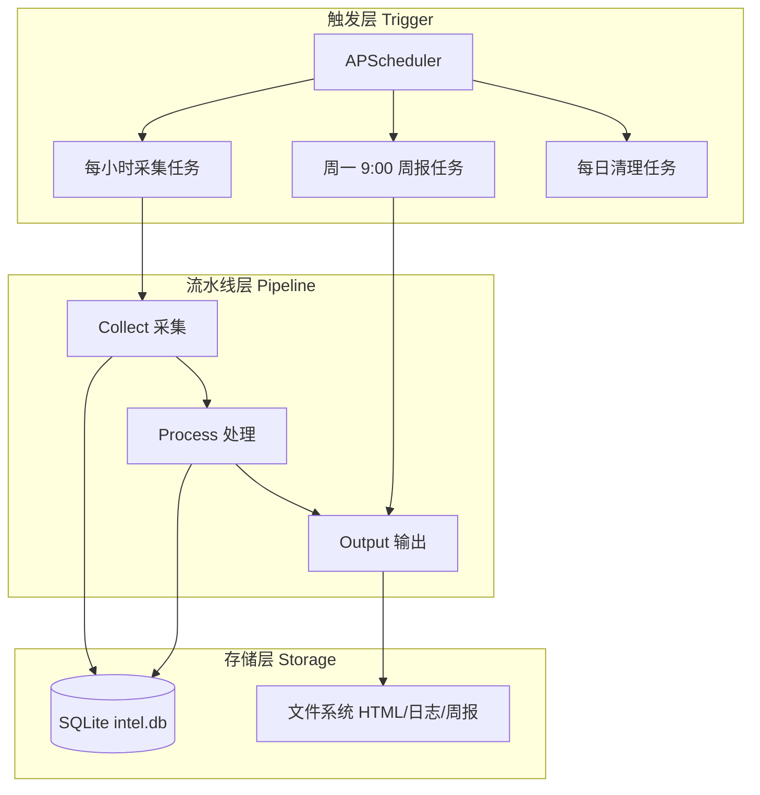
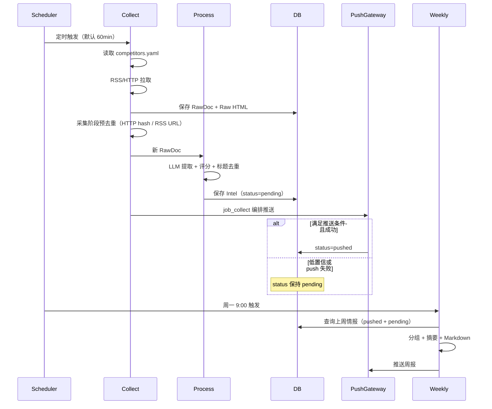
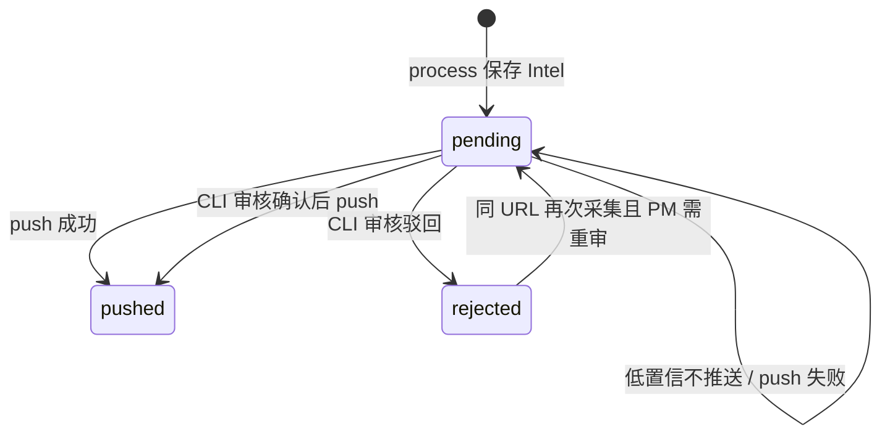

# 竞品情报 Agent 系统 Spec

## 1. Overview 概述

产品经理需要持续跟踪 3 个核心竞品的动态（新功能、交互变化、迭代方向），但手动收集信息每周耗时数小时，容易遗漏重要情报，且信息分散在不同渠道难以汇总对比，发现竞品动作时往往已滞后数天。

本系统是一个为产品经理设计的**竞品情报自动采集、去重、推送与周报汇总 Agent**。系统后台持续运行，定时从 RSS、静态网页、关键词搜索等公开渠道拉取竞品信息，经 LLM 提取结构化情报后，对高置信度情报实时推送至飞书/钉钉，低置信度情报沉淀待审核队列，每周一自动生成 Markdown 周报。

系统面向**单一用户**（产品经理本人），采用**本地/自托管**部署形态，数据不上云（除 LLM API 调用外），无 Web UI、无命令行查询，用户通过推送通道接收情报。

## 2. Goals & Non-Goals 目标与非目标

### Goals：本期落地范围

| 类别 | 内容 |
|------|------|
| 信息源 | RSS 订阅（官方博客、更新日志）、静态网页（产品页面）、关键词搜索（搜索引擎 API，Should） |
| 竞品数量 | 固定 3 个，通过配置文件管理（占位符：competitor_a / competitor_b / competitor_c） |
| 情报类型 | 新功能发布、UI/交互变化、版本更新、定价调整 |
| 采集频率 | 可配置间隔，默认 60 分钟，范围 15–120 分钟 |
| 输出形式 | 实时推送（飞书/钉钉）+ 周报汇总（Markdown） |
| 数据存储 | SQLite + 本地文件系统 |
| 核心场景 | A 采集与推送、B 周报生成、C 配置与运维、D 失败处理与降级、E 数据生命周期管理 |

### Non-Goals：明确剔除范围

| 类别 | 内容 |
|------|------|
| 采集能力（V1） | 不处理需要登录态/验证码的网站；不处理动态 JS 渲染页面；不做反爬绕过 |
| 情报类型 | 不处理融资动态、人员变动、用户评论、社交媒体舆情 |
| 分析能力 | 不做竞品对比分析、趋势预测、情感分析 |
| 交互方式 | 不支持自然语言查询；不提供 Web UI 或 API 接口 |
| 用户功能 | 不支撑多用户；不设已读/未读标记；不设收藏/标注功能 |
| 部署形态 | 不 SaaS 化，不提供云端托管 |

### 分期策略（SPA 处理）

| 阶段 | 策略 |
|------|------|
| V1（当前） | 优先选择有 RSS/静态版本的竞品；若官网为 SPA，降级为手动配置关键 URL（更新日志、博客），接受可能漏掉动态内容 |
| V2（后续） | 引入 Playwright/Selenium 做轻量级 SPA 渲染，仅针对特定竞品关键页面 |
| Won't Have | 不做大规模动态爬虫、不做验证码破解 |

## 3. Detailed Design 详细设计

### 3.1 系统架构

系统采用**三层确定性流水线**架构，无 Orchestrator、无状态图、无消息队列，核心逻辑为 for 循环 + 函数调用。



### 3.2 模块职责边界

| 模块 | Spec ID | 职责 |
|------|---------|------|
| L1-1 情报采集引擎 | SPEC-2026-010 | RSS/HTTP/搜索拉取，输出 RawDoc |
| L1-2 情报处理中心 | SPEC-2026-020 | 清洗 → LLM 提取 → 评分 → 去重，输出 Intel |
| L1-3 推送网关 | SPEC-2026-030 | 高置信度实时推送，低置信度沉淀，失败降级 |
| L1-4 周报工厂 | SPEC-2026-040 | 每周聚合情报，生成 Markdown 周报并推送 |
| L1-5 配置与运维中心 | SPEC-2026-050 | YAML 配置、结构化日志、Webhook 管理 |
| L1-6 韧性保障系统 | SPEC-2026-060 | 重试、LLM 降级、限流、静默模式 |
| L1-7 存储治理系统 | SPEC-2026-070 | SQLite CRUD、文件落盘、过期清理 |

### 3.3 端到端数据流



### 3.4 全局数据模型

所有模块共享以下 Pydantic 模型（定义于 `models.py`）：

```python
from pydantic import BaseModel, Field, HttpUrl
from datetime import datetime
from typing import Literal
from uuid import uuid4

class RawDoc(BaseModel):
    """采集输出"""
    id: str = Field(default_factory=lambda: uuid4().hex[:12])
    competitor: str                          # competitor_a | competitor_b | competitor_c
    source_url: HttpUrl
    source_type: Literal["rss", "http", "search"]
    title: str
    content: str                             # 清洗后的纯文本
    fetched_at: datetime = Field(default_factory=datetime.utcnow)

class Intel(BaseModel):
    """处理输出"""
    id: str = Field(default_factory=lambda: uuid4().hex[:12])
    raw_id: str
    competitor: str
    intel_type: Literal[
        "new_feature", "version_update",
        "pricing_change", "ui_change"
    ]
    title: str                               # ≤50 字
    summary: str                             # ≤100 字
    confidence: float = Field(ge=0.0, le=1.0)
    source_url: HttpUrl
    discovered_at: datetime = Field(default_factory=datetime.utcnow)
    status: Literal["pending", "pushed", "rejected"] = "pending"
    dedup_status: Literal["ok", "unchecked"] = "ok"
    extracted_by: Literal["llm", "rule_fallback"] = "llm"

class Weekly(BaseModel):
    """周报输出"""
    week_start: str                          # YYYY-MM-DD
    week_end: str                            # YYYY-MM-DD
    content: str                             # Markdown
    generated_at: datetime = Field(default_factory=datetime.utcnow)
```

**全局业务规则：**

| 规则 | 值 |
|------|-----|
| 推送置信度阈值 | confidence ≥ 0.8 |
| 强制推送类型 | intel_type = new_feature **且** extracted_by = llm 时强制推送 |
| 去重 URL 匹配 | 归一化后查 `intel.source_url`；**排除 status=rejected**；rss/search 在采集+处理阶段拦截 |
| 去重 content_hash | HTTP 在**采集阶段**查 `raw_doc`；content 未变则不产出 RawDoc |
| 去重标题相似度 | Post-LLM；difflib.SequenceMatcher ratio > 0.85；窗口 7 天 |
| Pre-LLM 原则 | **重复内容不调用 LLM** |
| 冷启动 | 首次 RSS 仅处理 published 在 `cold_start_days`（默认 7）天内的 entry |
| 单进程 | V1 仅允许单进程运行；collect job 用 asyncio.Lock 防重叠 |

### 3.5 竞品占位配置示例

```yaml
# config/competitors.yaml
interval_minutes: 60
cold_start_days: 7
timezone: "Asia/Shanghai"
feishu_webhook: "https://open.feishu.cn/open-apis/bot/v2/hook/xxx"
dingtalk_webhook: ""

competitors:
  - id: competitor_a
    name: "竞品 A（占位）"
    enabled: true
    sources:
      - type: rss
        url: "https://example.com/competitor_a/feed.xml"
      - type: http
        url: "https://example.com/competitor_a/changelog"
        name: "更新日志"

  - id: competitor_b
    name: "竞品 B（占位）"
    enabled: true
    sources:
      - type: rss
        url: "https://example.com/competitor_b/blog/feed.xml"
      - type: http
        url: "https://example.com/competitor_b/pricing"
        name: "定价页面"

  - id: competitor_c
    name: "竞品 C（占位）"
    enabled: true
    sources:
      - type: rss
        url: "https://example.com/competitor_c/releases.atom"
      - type: http
        url: "https://example.com/competitor_c/changelog"
        name: "版本更新"
```

### 3.6 项目目录结构

```
competitor-intel/
├── config/
│   ├── competitors.yaml          # 3 个竞品配置
│   └── settings.py                 # Pydantic 配置模型
├── intel/
│   ├── __init__.py
│   ├── collect.py                  # 采集：RSS + HTTP
│   ├── process.py                  # 处理：清洗 → 预去重 → LLM → 评分 → 标题去重
│   ├── push.py                     # 推送：飞书 + 失败降级
│   └── weekly.py                   # 周报：聚合 → LLM → Markdown
├── infra/
│   ├── __init__.py
│   ├── db.py                       # SQLite：连接 + CRUD
│   ├── llm/                        # LLM 可插拔层：Provider + 降级
│   │   ├── base.py                 # LLMProvider Protocol
│   │   ├── factory.py              # preset 注册 + create_provider
│   │   ├── fallback.py             # 规则降级
│   │   └── providers/
│   │       └── openai_compat.py    # OpenAI 兼容适配器
│   └── log.py                      # structlog：结构化 JSON 日志
├── prompts/
│   └── v1/
│       ├── extract.j2              # 情报提取 Prompt
│       └── weekly_summary.j2       # 周报总结 Prompt
├── data/
│   └── intel.db                    # SQLite 数据库（运行时生成）
├── storage/
│   └── raw/                        # Raw HTML 落盘
├── reports/
│   └── weekly/                     # 周报 Markdown 归档
├── docs/
│   ├── pricing-history/            # 定价变更 JSON 归档
│   └── changelogs/                 # 变更日志 JSON 归档
├── models.py                       # Pydantic 模型
├── scheduler.py                    # APScheduler 配置
├── main.py                         # 入口：启动调度器
├── run_once.py                     # 手动触发一次采集
├── scripts/
│   └── review_pending.py           # 低置信度人工审核 CLI
└── requirements.txt
```

### 3.7 功能场景映射（PRD → 模块）

| 场景 | 功能 ID | 负责模块 |
|------|---------|----------|
| A 采集与推送 | A-01 ~ A-08 | L1-1 + L1-2 + L1-3 |
| B 周报生成 | B-01 ~ B-08 | L1-4 |
| C 配置与运维 | C-01 ~ C-04 | L1-5 |
| D 失败处理与降级 | D-01 ~ D-08 | L1-6 |
| E 数据生命周期 | E-01 ~ E-04 | L1-7 |

### 3.8 时区与 timestamp 规范

**统一策略：存储 UTC，展示/计算用配置时区，查询前转换。**

| 环节 | 格式 | 说明 |
|------|------|------|
| 数据库存储 | UTC ISO8601，后缀 `Z` | 例：`2026-05-30T02:00:00Z`；禁止混用带 offset 字符串入库 |
| Python 写入 | `datetime.now(timezone.utc).isoformat().replace("+00:00", "Z")` | RawDoc.fetched_at、Intel.discovered_at |
| 周报边界计算 | 在 `SETTINGS.timezone` 下计算上周一 00:00 ~ 周日 23:59 | 使用 zoneinfo |
| 数据库查询 | **将边界转换为 UTC 后再 BETWEEN** | 避免 SQLite 字符串比较时区混乱 |

```python
def to_utc_iso(dt: datetime) -> str:
    """带时区的 datetime → UTC Z 字符串，用于 SQL 查询"""
    return dt.astimezone(timezone.utc).strftime("%Y-%m-%dT%H:%M:%SZ")

def get_last_week_range_utc(timezone: str) -> tuple[str, str]:
    """在配置时区计算自然周边界，返回 UTC 字符串供 SQL 使用"""
    tz = ZoneInfo(timezone)
    now = datetime.now(tz)
    days_since_monday = now.weekday()
    last_monday = (now - timedelta(days=days_since_monday + 7)).replace(
        hour=0, minute=0, second=0, microsecond=0
    )
    week_end = last_monday + timedelta(days=6, hours=23, minutes=59, seconds=59)
    return to_utc_iso(last_monday), to_utc_iso(week_end)
```

**展示层：** 推送消息、周报 Markdown 中的时间按 `SETTINGS.timezone` 格式化给用户阅读。

### 3.9 调度任务注册表（scheduler.py）

所有定时任务在 `scheduler.py` 统一注册，时区使用 `SETTINGS.timezone`：

| Job ID | 触发规则 | 函数 | 负责 Spec | 优先级 |
|--------|----------|------|-----------|--------|
| `collect` | interval，`interval_minutes`（默认 60）；启动后立即执行一次 | `job_collect` | 010 | Must |
| `weekly` | cron，周一 09:00 | `job_weekly` | 040 | Must |
| `cleanup_failed_push` | cron，每日 01:00 | `job_cleanup_failed_push` | 070 | Should |
| `cleanup_logs` | cron，每日 02:00 | `job_cleanup_logs` | 050 | Should |
| `cleanup_raw_html` | cron，每日 03:00 | `job_cleanup_raw_html` | 070 | Must |
| `disk_check` | interval，每 60 分钟 | `job_disk_check` | 060 | Should |

```python
# scheduler.py 注册示例
scheduler = AsyncIOScheduler(timezone=SETTINGS.timezone)
scheduler.add_job(job_collect, "interval", minutes=SETTINGS.interval_minutes,
                  id="collect", next_run_time=datetime.now())
scheduler.add_job(job_weekly, "cron", day_of_week="mon", hour=9, minute=0, id="weekly")
scheduler.add_job(job_cleanup_failed_push, "cron", hour=1, minute=0, id="cleanup_failed_push")
scheduler.add_job(job_cleanup_logs, "cron", hour=2, minute=0, id="cleanup_logs")
scheduler.add_job(job_cleanup_raw_html, "cron", hour=3, minute=0, id="cleanup_raw_html")
scheduler.add_job(job_disk_check, "interval", minutes=60, id="disk_check")
```

**原则：** 010/040 Spec 仅描述任务业务逻辑；cron 注册表以本节为准，避免分散定义。

### 3.10 Intel 状态机



| 状态 | 含义 | 进入条件 | 退出条件 |
|------|------|----------|----------|
| pending | 已入库，未成功推送 | save_intel 默认 | push 成功 → pushed；CLI 驳回 → rejected |
| pushed | 已推送 | push 返回成功 | 终态 |
| rejected | 人工驳回 | CLI 输入 n | 同 URL 再次采集时可重新处理（见去重规则） |

**URL 去重与 rejected 的关系：** `intel_url_exists()` 仅匹配 status ∈ {pending, pushed}。status=rejected 的记录不阻断同 URL 再次进入流水线，允许 PM 驳回后竞品重新发布时被重新捕获。

**push 失败：** status 保持 pending；写入 failed_push 队列；由周报汇总或 CLI 补推。不自动重试推送（V1）。

**编排边界：** `process()` 只负责清洗→LLM→去重→save_intel，**不调用 push**；推送由 `job_collect`（`main.py` 编排层）在 save 成功后调用。

## 4. Technical Constraints 技术约束

| 组件 | 技术选型 | 版本约束 |
|------|----------|----------|
| 运行时 | Python | ≥ 3.11 |
| HTTP 客户端 | httpx | ≥ 0.27.0 |
| RSS 解析 | feedparser | ≥ 6.0.0 |
| HTML 正文提取 | trafilatura | ≥ 1.6.0 |
| HTML 备用解析 | beautifulsoup4 | ≥ 4.12.0 |
| 数据校验 | pydantic + pydantic-settings | ≥ 2.0.0 |
| YAML 解析 | pyyaml | ≥ 6.0.0 |
| LLM | OpenAI 兼容 SDK + 可插拔 Provider（默认 openai/gpt-4o-mini） | ≥ 1.0.0 |
| 结构化日志 | structlog | ≥ 24.0.0 |
| 定时调度 | apscheduler | ≥ 3.10.0 |
| 重试 | tenacity | ≥ 8.0.0 |
| Prompt 模板 | jinja2 | ≥ 3.0 |
| 文本相似度 | difflib (标准库) | — |
| 数据库 | SQLite | 3.x（Python 内置） |

**性能阈值：**

| 指标 | 目标值 |
|------|--------|
| 单次采集任务（3 竞品全部源） | ≤ 5 分钟 |
| 单 HTTP 请求超时 | ≤ 10 秒 |
| 历史情报查询（30 天） | ≤ 100 ms |
| 推送链路延迟（去重+评分+推送） | ≤ 30 秒 |
| 定时任务总超时 | 30 分钟（超时强制终止） |

**安全规范：**

- LLM API Key 按 `llm.api_key_env` 从环境变量注入，禁止写入 YAML 或日志
- Webhook URL 仅存于 `competitors.yaml`，日志中脱敏显示（仅保留末 4 位）
- 所有时间戳统一 **UTC ISO8601（Z 后缀）** 存储（见 §3.8）；展示时按 `timezone` 配置转换

## 5. Error Handling 异常错误处理

系统级降级模式由 L1-6 韧性保障系统实现，此处为总览：

| 模式 | 触发条件 | 行为 |
|------|----------|------|
| normal | 默认 | 全功能运行 |
| rate_limited | LLM 连续失败 3 次 | 暂停 LLM 调用 15 分钟，仅规则提取 |
| silent | 磁盘使用率 > 90% | 停止写入 `storage/raw/`，继续推送已有情报 |
| readonly | DB 连接失败 | 新情报暂存本地 JSON 文件，恢复后批量导入 |

**单点故障隔离原则：** 任意单个信息源失败不阻塞其他源；任意单条情报处理失败不阻塞批次内其他情报。

| 错误类型 | 处理策略 | 负责 Spec |
|----------|----------|-----------|
| 网络超时/连接失败 | 指数退避重试 3 次（1s/2s/4s） | SPEC-2026-060 |
| HTTP 4xx | 不重试；404 标记源失效 | SPEC-2026-060 |
| HTTP 5xx | 重试 2 次 | SPEC-2026-060 |
| LLM 限流/超时 | 重试 2 次 → 规则提取降级 | SPEC-2026-060 |
| LLM 非 JSON 返回 | 重试 1 次 strict → pending 队列 | SPEC-2026-060 |
| 推送 Webhook 失败 | 重试 2 次（5s）→ 写入失败队列 | SPEC-2026-030 |
| 去重查询超时 | 跳过去重，标记 dedup_status=unchecked | SPEC-2026-020 |

## 6. Acceptance Criteria 验收标准

**AC-1：采集覆盖率 SLO**

- Given：3 个竞品各配置 2 个有效信息源，系统正常运行 24 小时
- When：统计 24 小时内各源的成功采集次数
- Then：采集成功率 ≥ 98%（成功 = HTTP 200 且解析出 ≥ 0 条 entry）

**AC-2：推送及时性 SLO**

- Given：系统发现一条 confidence=0.9 的新情报
- When：完成去重和置信度评分
- Then：飞书 Webhook 在 30 秒内收到推送消息

**AC-3：情报发现延迟 SLO**

- Given：采集间隔配置为 60 分钟，竞品发布新功能公告
- When：系统完成采集、处理、推送全链路
- Then：95% 的情报在发布后 75 分钟内完成推送

**AC-4：系统可用性 SLO**

- Given：系统连续运行 30 天
- When：统计核心采集+推送链路的可用时间
- Then：可用性 ≥ 99%（不可用 = 连续 3 次采集任务全部失败）

**AC-5：LLM 提取成功率 SLO**

- Given：100 条有效 RawDoc 输入处理流水线
- When：统计成功输出结构化 Intel 的比例（含规则降级）
- Then：成功率 ≥ 95%

**AC-6：去重准确率 SLO**

- Given：50 组测试数据（25 组重复 + 25 组不重复）
- When：执行 Pre-LLM（URL/hash）+ Post-LLM（标题）双层去重
- Then：准确率 ≥ 90%；Pre-LLM 阶段重复项零 LLM 调用

**AC-7：周报准时交付**

- Given：系统运行至周一 9:00
- When：周报定时任务触发
- Then：飞书在 9:05 前收到包含 3 个竞品上周动态的 Markdown 消息

**AC-8：单源故障隔离**

- Given：3 个竞品共 6 个源，其中 1 个源返回 500 错误
- When：执行一次采集任务
- Then：其余 5 个源正常采集；失败源记录错误日志；任务整体标记 partial_success

## 7. Context References 参考依赖

| 类型 | 引用 |
|------|------|
| L2 模块 Spec | SPEC-2026-010（采集）、SPEC-2026-020（处理）、SPEC-2026-030（推送）、SPEC-2026-040（周报）、SPEC-2026-050（配置）、SPEC-2026-060（韧性）、SPEC-2026-070（存储） |
| 数据模型 | `models.py` — RawDoc / Intel / Weekly |
| 配置文件 | `config/competitors.yaml` |
| 入口 | `main.py` / `run_once.py` |
| 外部依赖 | OpenAI API (GPT-4o-mini)、飞书 Webhook API、钉钉 Webhook API |

## 8. Open Questions 待定问题

| # | 问题 | 影响范围 | 建议 |
|---|------|----------|------|
| Q-1 | 搜索引擎 API 选型（Google Custom Search / Bing / SerpAPI） | L1-1 搜索采集器 | V1 标记 Should，可延后 |
| Q-2 | 周报是否支持邮件推送通道 | L1-4 周报推送 | V1 仅飞书，邮件作为 Could Have |
| Q-3 | SQLite 是否需迁移至 PostgreSQL | L1-7 存储 | V1 SQLite 足够，数据量 < 10 万条 |
| Q-4 | 竞品真实名称与信息源 URL 替换时机 | 全局配置 | 开发联调前由 PM 提供 |

## 9. Changelog 变更履历

| 日期 | 版本 | 修改内容 | 修改人 |
|------|------|----------|--------|
| 2026-05-30 | 1.0 | 初稿创建 | Product Team |
| 2026-05-30 | 1.1 | P0 修订：时区规范 §3.8；调度任务注册表 §3.9；Pre-LLM 去重规则 | Product Team |
| 2026-05-30 | 1.3 | LLM 可插拔 Provider 架构 | Product Team |
| 2026-05-30 | 1.2 | P0/P1：Intel 状态机 §3.10；HTTP 采集阶段去重；push 编排边界；rejected 可重采；冷启动 | Product Team |
