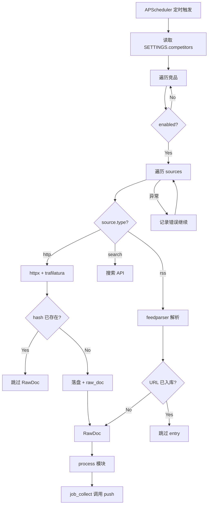

# 情报采集引擎 Spec

## 1. Overview 概述

情报采集引擎（L1-1）是竞品情报 Agent 流水线的起点，负责从配置的信息源（RSS、静态网页、搜索引擎 API）定时拉取竞品原始内容，转换为统一的 RawDocument 格式，并落盘原始 HTML。采集引擎的核心设计原则是**单源失败不阻塞**：任意单个源失败不影响同竞品其他源及其他竞品的采集。

本模块对应 PRD 场景 A 的前半段，实现功能 A-01（定时触发）、A-02（信息源读取）、A-03（内容标准化）。

## 2. Goals & Non-Goals 目标与非目标

### Goals：本期落地范围

- RSS 源配置解析与 Feed 拉取（Must）
- 静态网页 HTTP 采集与正文提取（Must）
- RawDocument 标准化输出（Must）
- APScheduler 定时调度，默认 60 分钟间隔（Must）
- 采集阶段预去重（HTTP content_hash / RSS URL，Must）
- RSS 冷启动过滤（published 超出 cold_start_days 跳过，Must）
- 搜索引擎 API 采集（Should）

### Non-Goals：明确剔除范围

- 不处理需要登录态/验证码的网站
- 不处理动态 JS 渲染页面（V1）
- 不做反爬绕过（User-Agent 轮换、代理池等）
- 不做增量采集（每次全量拉取最近 N 条）
- 不做采集结果缓存（Pre-LLM 预去重由本模块在产出 RawDoc **之前**执行）

## 3. Detailed Design 详细设计

### 3.1 功能描述

采集引擎包含 4 个子模块：

| 子模块 | L2 ID | 职责 |
|--------|-------|------|
| RSS 采集器 | L2-1.1 | 解析 RSS/Atom Feed，提取 entry |
| 静态网页采集器 | L2-1.2 | HTTP GET + HTML 正文提取 |
| 搜索采集器 | L2-1.3 | 搜索引擎 API 关键词搜索 |
| 采集调度中心 | L2-1.4 | APScheduler 定时触发 + 并发控制 |

### 3.2 数据模型

#### RawDocument 输出 Schema

采集引擎输出符合 SPEC-2026-001 定义的全局 RawDoc 模型：

| 字段 | 类型 | 必填 | 说明 |
|------|------|------|------|
| id | string(12) | 是 | uuid4().hex[:12] |
| competitor | string | 是 | competitor_a / b / c |
| source_url | HttpUrl | 是 | 原始文章 URL（RSS entry.link 或 HTTP 源 URL） |
| source_type | enum | 是 | rss / http / search |
| title | string | 是 | RSS：entry.title；HTTP：**页面真实标题**（trafilatura metadata 或 `<title>`）；search：result.title；空时用 "Untitled" |
| content | string | 是 | 清洗后纯文本，最大 5000 字符 |
| fetched_at | datetime | 是 | ISO8601 UTC |

### 3.3 L3 任务详细设计

#### L3-1.1.1 RSS 源配置解析 [Must]

**行为：**
- 从 `SETTINGS.competitors` 读取所有 type=rss 的源
- 解析每个源的 url 字段
- 缺失 url → 启动时由 Pydantic 校验拦截（SPEC-2026-050）
- 运行时如果发现源 url 为空 → 跳过该源，日志 warning `rss_url_empty`

#### L3-1.1.2 RSS Feed 拉取与解析 [Must]

**行为：**
- 使用 feedparser 解析 RSS/Atom Feed
- feedparser.parse 在线程池执行（避免阻塞 asyncio 事件循环）
- 有效 Feed：返回 ≥ 0 条 entry（空 Feed 不算错误）
- 无效 URL（404/超时）：返回明确错误，不抛未捕获异常
- 每个 Feed 仅取最近 10 条 entry（`feed.entries[:10]`）
- **采集阶段预去重与冷启动（在产出 RawDoc 之前）：**
  1. entry 无 link → 跳过
  2. `normalize_url(entry.link)` 命中 `intel_url_exists`（pending/pushed）→ 跳过，日志 `collect_pre_dedup_skipped`
  3. `published` 早于 `now - cold_start_days`（默认 7 天）→ 跳过，日志 `collect_stale_entry`（冷启动/历史过滤）
  4. 通过上述检查后 → 产出 RawDoc，并写入 `raw_doc` 元数据

```python
async def _collect_rss(competitor_id: str, source: dict) -> list[RawDoc]:
    loop = asyncio.get_event_loop()
    feed = await loop.run_in_executor(None, feedparser.parse, source["url"])
    if feed.bozo and not feed.entries:
        logger.warning("rss_parse_error", url=source["url"], error=str(feed.bozo_exception))
        return []
    results = []
    cutoff = datetime.now(timezone.utc) - timedelta(days=SETTINGS.cold_start_days)
    for entry in feed.entries[:10]:
        if not entry.get("link"):
            continue
        url = normalize_url(entry.link)
        if db.intel_url_exists(url):
            continue
        if entry.get("published_parsed"):
            pub = datetime(*entry.published_parsed[:6], tzinfo=timezone.utc)
            if pub < cutoff:
                continue
        content = entry.get("summary", "") or entry.get("description", "")
        raw = RawDoc(
            competitor=competitor_id,
            source_url=entry.link,
            source_type="rss",
            title=entry.title or "Untitled",
            content=content,
        )
        db.save_raw_doc(raw, file_path=None)
        results.append(raw)
    return results
```

**边界：**
- entry 无 link 字段 → 跳过该 entry
- entry 无 title → 使用 "Untitled"
- Feed 返回 0 条 entry → 返回空列表，日志 info `rss_empty_feed`

#### L3-1.1.3 RSS 内容标准化 [Must]

**行为：**
- 输出 RawDoc 全部 6 个必填字段 100% 完整
- content 字段去除 HTML 标签（feedparser 可能返回 HTML summary）
- 使用简单正则或 BeautifulSoup 去标签：`<[^>]+>` → 空
- content 截断至 5000 字符
- fetched_at 自动填充当前 UTC 时间
- **仅对通过预去重的 entry 写入 `raw_doc` 元数据**（file_path=NULL，见 SPEC-2026-070 L3-7.2.1）

#### L3-1.1.4 采集阶段预去重（Collect-time Pre-dedup）[Must]

**原则：** 预去重在**产出 RawDoc 之前**执行；`raw_doc` 仅对新内容写入。避免「先写 raw_doc 再 Pre-LLM 导致首采被误判重复」的时序 bug。

| source_type | 采集阶段检查 | 命中时行为 |
|-------------|-------------|-----------|
| http | `content_hash_exists(hash)` | 仅 `touch_raw_doc_by_hash`；**不产出 RawDoc** |
| rss / search | `intel_url_exists(normalized_url)` | 不产出 RawDoc |
| 全部 | 见各源 L3 小节 | 日志 `collect_pre_dedup_skipped` |

#### L3-1.2.1 HTTP 客户端封装 [Must]

**行为：**
- 使用 httpx.AsyncClient，超时 10s
- 应用 SPEC-2026-060 的重试策略（网络超时 3 次退避，5xx 重试 2 次）
- 4xx 不重试，直接失败
- 请求头：`User-Agent: CompetitorIntelBot/1.0`
- 成功（200）：返回 response.text
- 非 200：按 SPEC-2026-060 状态码分层处理

```python
async def _collect_http(competitor_id: str, source: dict) -> list[RawDoc]:
    async with httpx.AsyncClient(timeout=10, follow_redirects=True) as client:
        resp = await fetch_with_retry(client, source["url"])
        from trafilatura import bare_extraction
        doc = bare_extraction(resp.text, with_metadata=True)
        if doc:
            content = doc.get("text") or ""
            title = doc.get("title") or _extract_html_title(resp.text) or source.get("name", "Untitled")
        else:
            content = trafilatura_extract(resp.text) or ""
            title = _extract_html_title(resp.text) or source.get("name", "Untitled")
        content = content[:5000]
        h = compute_content_hash(competitor_id, source["url"], content)
        if db.content_hash_exists(h):
            db.touch_raw_doc_by_hash(h)
            logger.info("collect_pre_dedup_skipped", source=source["url"], reason="hash_unchanged")
            return []
        file_path = await save_raw_html(competitor_id, source["url"], resp.text, content, h)
        raw = RawDoc(
            competitor=competitor_id,
            source_url=source["url"],
            source_type="http",
            title=title[:200],
            content=content,
        )
        db.save_raw_doc(raw, file_path=file_path)
        return [raw]

def _extract_html_title(html: str) -> str:
    from bs4 import BeautifulSoup
    tag = BeautifulSoup(html, "html.parser").find("title")
    return tag.get_text(strip=True) if tag else ""
```

**title 提取优先级（HTTP）：**
1. trafilatura metadata.title
2. HTML `<title>` 标签
3. `source.name`（配置中的页面描述，如「更新日志」）
4. "Untitled"

#### L3-1.2.2 静态页内容标准化 [Must]

**行为：**
- 使用 trafilatura `bare_extraction(with_metadata=True)` 提取正文与 title（主方案）
- trafilatura 返回空时，降级 BeautifulSoup 提取 body 文本 + `<title>`
- **禁止**将 `source.name` 作为 title 首选（仅作 fallback）
- 输出符合 RawDoc Schema
- 原始 HTML 通过 SPEC-2026-070 落盘到 storage/raw/，并写入 raw_doc 元数据

**边界：**
- 页面纯 SPA 无静态内容 → trafilatura 返回空 → content="" → 仍输出 RawDoc，由处理模块判定为低置信度

#### L3-1.3.1 搜索 API 配置与执行 [Should]

**行为：**
- 读取 `SETTINGS.search` 配置
- enabled=false 时跳过
- 调用搜索引擎 API（provider 可配置）
- 每个关键词返回 max_results 条结果
- 每条结果映射为 RawDoc：source_type="search", title=result.title, content=result.snippet

**边界：**
- API Key 未配置 → 日志 warning，跳过搜索采集
- API 限流 → 按 SPEC-2026-060 重试策略

#### L3-1.4.1 APScheduler 定时器配置 [Must]

**行为：**
- 使用 APScheduler AsyncIOScheduler
- 采集任务：`interval` 触发，间隔 = `SETTINGS.interval_minutes`（默认 60）
- 进程启动后立即执行一次采集（`next_run_time=datetime.now()`）
- **全部 cron/interval 任务注册表见 SPEC-2026-001 §3.9**；本模块仅实现 `job_collect` 业务逻辑
- 支持 graceful shutdown：捕获 SIGINT/SIGTERM，等待当前任务完成后退出
- 每次触发记录日志：`job_start` / `job_end`

```python
scheduler = AsyncIOScheduler()
scheduler.add_job(
    job_collect, "interval",
    minutes=SETTINGS.interval_minutes,
    id="collect",
    next_run_time=datetime.now()
)
```

#### L3-1.4.2 多源并发控制与 job 编排 [Must]

**行为：**
- 遍历 3 个竞品，跳过 enabled=false
- 每个竞品内遍历所有 sources，逐源采集
- 单源 / 单条 RawDoc 异常 try/except 捕获，继续执行
- 3 竞品 × 平均 2 源采集耗时 ≤ 5 分钟（不含 LLM）
- **job 重叠保护：** `asyncio.Lock`；上次 collect 未完成则跳过，日志 `job_collect_skipped_overlap`
- V1 串行逐源

**编排职责：** `process()` 不推送；`job_collect` 在 `process` 返回 Intel 后调用 `push()`（见 SPEC-2026-001 §3.10）

```python
_collect_lock = asyncio.Lock()

async def job_collect():
    if _collect_lock.locked():
        logger.warning("job_collect_skipped_overlap")
        return
    async with _collect_lock:
        log.logger.info("job_start", type="collection")
        total_new, sources_failed = 0, 0
        for competitor in SETTINGS.competitors:
            if not competitor.enabled:
                continue
            try:
                raw_docs = await collect.collect_all(competitor)
            except Exception as e:
                sources_failed += 1
                logger.error("collect_failed", competitor=competitor.id, error=str(e))
                continue
            for raw in raw_docs:
                try:
                    intel = await process.process(raw)
                    if intel:
                        total_new += 1
                        await push.push(intel, SETTINGS.feishu_webhook)
                except Exception as e:
                    logger.error("process_failed", raw_id=raw.id, error=str(e))
        log.logger.info("job_end", type="collection", intel_new=total_new, sources_failed=sources_failed)
```

### 3.4 业务流程图



## 4. Technical Constraints 技术约束

| 约束 | 值 |
|------|-----|
| RSS 解析 | feedparser ≥ 6.0 |
| HTTP 客户端 | httpx ≥ 0.27，超时 10s |
| 正文提取 | trafilatura ≥ 1.6（主），beautifulsoup4 ≥ 4.12（备） |
| 调度器 | apscheduler ≥ 3.10，AsyncIOScheduler |
| RSS entry 上限 | 每 Feed 最近 10 条 |
| content 最大长度 | 5000 字符 |
| 并发模型 | V1 串行逐源（满足 5 分钟 SLO） |
| 采集间隔 | 15–120 分钟，默认 60 |

## 5. Error Handling 异常错误处理

| 异常 | 处理 | 日志事件 |
|------|------|----------|
| RSS URL 不可达 | 重试后失败，跳过该源 | collect_failed |
| RSS 解析异常（bozo） | 有 entry 则继续，无 entry 则跳过 | rss_parse_error |
| HTTP 4xx | 不重试，跳过 | http_client_error |
| HTTP 5xx | 重试 2 次后跳过 | collect_failed |
| 网络超时 | 重试 3 次后跳过 | collect_failed |
| trafilatura 提取为空 | 降级 BeautifulSoup | content_extract_fallback |
| 竞品 enabled=false | 跳过 | — |
| 静默模式（磁盘满） | 跳过 Raw HTML 落盘 | silent_mode_skip |

## 6. Acceptance Criteria 验收标准

**AC-1：RSS 正常采集**

- Given：有效 RSS Feed URL，包含 5 条 entry
- When：调用 _collect_rss()
- Then：返回 5 个 RawDoc；每个含完整 6 字段；source_type=rss

**AC-2：RSS 空 Feed**

- Given：有效但无 entry 的 RSS Feed
- When：调用 _collect_rss()
- Then：返回空列表；日志 info rss_empty_feed；不抛异常

**AC-3：RSS 无效 URL**

- Given：不存在的 RSS URL（404）
- When：调用 _collect_rss()
- Then：返回空列表；日志 warning collect_failed；不抛未捕获异常

**AC-4：HTTP 静态页采集**

- Given：返回 200 的静态 HTML 页面，`<title>` 为 "Changelog - Product"
- When：调用 _collect_http()
- Then：返回 1 个 RawDoc；title="Changelog - Product"（非 source.name）；content 为纯文本；原始 HTML 落盘；raw_doc 有元数据记录

**AC-4b：HTTP title fallback**

- Given：页面无 `<title>` 且 trafilatura 无 metadata
- When：调用 _collect_http()，source.name="更新日志"
- Then：RawDoc.title="更新日志"

**AC-5：HTTP 4xx 不重试**

- Given：目标 URL 返回 403
- When：HTTP 客户端请求
- Then：仅 1 次请求；日志 decision=no_retry

**AC-6：RawDoc 字段完整性**

- Given：任意采集路径产出的 RawDoc
- When：Pydantic 校验
- Then：id/competitor/source_url/source_type/title/content/fetched_at 全部非空

**AC-7：定时调度触发**

- Given：interval_minutes=60，进程启动
- When：等待首次触发
- Then：日志 job_start type=collection；启动后立即执行一次

**AC-8：单源失败不阻塞**

- Given：6 个源中 1 个超时失败
- When：执行 job_collect()
- Then：其余 5 个源正常采集；日志 sources_failed=1；job_end status=partial_success

**AC-9：5 分钟完成约束**

- Given：3 竞品各 2 源，全部源响应正常（< 2s/源）
- When：执行 job_collect()
- Then：总耗时 ≤ 5 分钟（300 秒）

**AC-10：并发安全**

- Given：两个源同时返回相同 content_hash 的内容
- When：采集并落盘
- Then：raw_doc 表 UNIQUE 约束阻止重复；仅 1 个文件存在

**AC-11：RSS 写入 raw_doc 元数据**

- Given：RSS 采集返回 3 条新 entry（通过预去重）
- When：采集完成
- Then：raw_doc 表新增 3 条记录（file_path=NULL）

**AC-12：HTTP 采集阶段 hash 去重**

- Given：HTTP 页 content_hash 已在 raw_doc
- When：再次采集同一页面且内容未变
- Then：返回空列表；不产出 RawDoc；日志 collect_pre_dedup_skipped

**AC-13：HTTP 首次采集进入 LLM**

- Given：HTTP 页首次采集，content_hash 不存在
- When：collect → process
- Then：产出 RawDoc；process 正常调用 LLM

**AC-14：RSS 冷启动过滤**

- Given：Feed 含 1 条 30 天前的 entry 和 1 条 1 天前的 entry；cold_start_days=7
- When：_collect_rss()
- Then：仅返回 1 条 RawDoc（新 entry）

**AC-15：job 重叠跳过**

- Given：上次 job_collect 仍在运行
- When：定时器再次触发
- Then：日志 job_collect_skipped_overlap；不启动并行 collect

## 7. Context References 参考依赖

| 类型 | 引用 |
|------|------|
| 系统 Spec | SPEC-2026-001（RawDoc 模型） |
| 配置 Spec | SPEC-2026-050（competitors.yaml） |
| 韧性 Spec | SPEC-2026-060（HTTP 重试策略） |
| 存储 Spec | SPEC-2026-070（Raw HTML 落盘） |
| 处理 Spec | SPEC-2026-020（下游消费者） |
| 代码文件 | `intel/collect.py`, `scheduler.py`, `main.py` |

## 8. Open Questions 待定问题

| # | 问题 | 建议 |
|---|------|------|
| Q-1 | 是否需要竞品级 asyncio.gather 并发 | V1 串行足够，若超时再改并发 |
| Q-2 | RSS entry 10 条上限是否可配置 | V1 硬编码，V2 加入配置 |

## 9. Changelog 变更履历

| 日期 | 版本 | 修改内容 | 修改人 |
|------|------|----------|--------|
| 2026-05-30 | 1.0 | 初稿创建 | Product Team |
| 2026-05-30 | 1.1 | P0 修订：HTTP title 从页面提取；RSS 写 raw_doc 元数据 | Product Team |
| 2026-05-30 | 1.2 | P0/P1：采集阶段预去重；冷启动；job 编排与 Lock；bare_extraction | Product Team |
