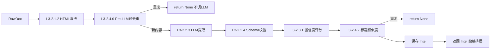

# 情报处理中心 Spec

## 1. Overview 概述

情报处理中心（L1-2）是竞品情报 Agent 流水线的核心处理模块，接收采集引擎输出的 RawDocument，经 HTML 清洗、**Pre-LLM 预去重**、LLM 结构化提取、置信度评分、标题去重后，输出带 confidence 的 Intel 情报对象。Pre-LLM 预去重是 V1 关键设计：**在调用 LLM 之前拦截重复内容**，避免每小时重复 RSS 条目触发无效 API 调用。处理中心的设计重点是**提取准确性**和**去重可靠性**，同时通过 SPEC-2026-060 的降级策略保证 LLM 不可用时流水线不中断。

本模块对应 PRD 场景 A 的后半段，实现功能 A-03（内容标准化）、A-04（情报提取）、A-05（智能去重）、A-06（置信度评分）、A-08（低置信度沉淀）。

## 2. Goals & Non-Goals 目标与非目标

### Goals：本期落地范围

- RawDocument Schema 定义与校验（Must）
- HTML 文本清洗（Must）
- LLM 结构化情报提取 + Prompt 模板管理（Must）
- OpenAI API 客户端封装（重试 + Token 记录）（Must）
- 提取结果 Pydantic Schema 校验（Must）
- 规则置信度评分引擎（Must）
- Pre-LLM 预去重（URL / content_hash，Must）
- Post-LLM 标题相似度去重（Must）
- 历史情报库查询接口（Must）

### Non-Goals：明确剔除范围

- 不做向量数据库语义去重（V2）
- 不做竞品对比分析
- 不做情感分析或趋势预测
- 不做多模型 Ensemble（仅 GPT-4o-mini）
- 不做 LLM 输出的人工校验 UI

## 3. Detailed Design 详细设计

### 3.1 功能描述

处理流水线为纯函数调用链，按序执行：



**模块边界：** 本模块**不调用 push**；推送路由由 `job_collect` 调用 SPEC-2026-030（见 SPEC-2026-001 §3.10）。

### 3.2 数据模型

#### Intel 输出 Schema

符合 SPEC-2026-001 全局 Intel 模型。补充处理阶段特有字段：

| 字段 | 处理阶段赋值规则 |
|------|------------------|
| intel_type | LLM 提取或规则降级判定 |
| confidence | 规则评分引擎计算，0.0–1.0 |
| status | 默认 pending；push 成功后由 030 更新为 pushed |
| dedup_status | ok / unchecked（去重超时） |
| extracted_by | llm / rule_fallback；写入 Intel 表 |

#### LLM 提取输出 Schema

```python
class LLMExtractResult(BaseModel):
    intel_type: Literal["new_feature", "version_update", "pricing_change", "ui_change"]
    title: str = Field(max_length=50)
    summary: str = Field(max_length=100)
```

### 3.3 L3 任务详细设计

#### L3-2.1.1 RawDocument Schema 定义 [Must]

**行为：**
- 在 `models.py` 中定义 RawDoc Pydantic 模型（见 SPEC-2026-001 §3.4）
- 6 个必填字段，非法数据实例化时抛 ValidationError 并提示具体字段
- source_type 枚举：rss / http / search
- source_url 必须为合法 URL

#### L3-2.1.2 HTML 文本清洗 [Must]

**行为：**
- 输入：RawDoc.content（可能含 HTML 标签、广告、导航文本）
- 处理步骤：
  1. 去除 HTML 标签：`<[^>]+>` → 空
  2. 去除多余空白：连续换行/空格合并
  3. 去除常见广告关键词行（"分享到"、"相关阅读"等）
- 输出：清洗后纯文本
- 验收标准：输入含广告/导航的 HTML，输出纯文本长度减少 ≥ 30%，正文核心内容保留

```python
def clean_content(content: str) -> str:
    import re
    text = re.sub(r"<[^>]+>", "", content)
    text = re.sub(r"\n{3,}", "\n\n", text)
    noise_patterns = ["分享到", "相关阅读", "推荐阅读", "广告", "Share this"]
    lines = [l for l in text.split("\n") if not any(p in l for p in noise_patterns)]
    return "\n".join(lines).strip()
```

#### L3-2.2.1 Prompt 模板管理 [Must]

**行为：**
- 模板文件：`prompts/v1/extract.j2`
- 使用 Jinja2 渲染，变量：`title`, `content`, `competitor`, `source_type`
- 支持热加载：每次调用时从文件读取（V1 简单实现）
- System Prompt 明确要求 JSON 输出格式

```jinja2
{# prompts/v1/extract.j2 #}
从以下竞品内容中提取情报，返回 JSON：
{
  "intel_type": "new_feature|version_update|pricing_change|ui_change",
  "title": "标题（20字内）",
  "summary": "一句话摘要（50字内）"
}

竞品：{{ competitor }}
来源类型：{{ source_type }}
标题：{{ title }}

内容：
{{ content[:3000] }}
```

#### L3-2.2.2 LLM Provider 调用（via infra/llm）[Must]

**行为：**
- 调用 `infra/llm.extract(raw)` 门面；底层 Provider/model 由 SPEC-2026-050 `llm` 配置决定
- Provider 在 `json_mode=True` 时使用 `response_format={"type": "json_object"}`（不支持时适配器降级）
- 参数：`max_tokens` 来自 `llm.max_tokens_extract`，`timeout` 来自 `llm.timeout`
- 应用 SPEC-2026-060 重试策略（429/超时重试 2 次）
- 每次调用记录日志：`llm_call`，含 provider、model、input_tokens、output_tokens、duration_ms
- API Key 从环境变量读取（按 `llm.api_key_env` 或 preset 默认），禁止写入 YAML

#### L3-2.2.3 结构化情报提取 [Must]

**行为：**
- 调用 LLM 获取 JSON → 解析为 LLMExtractResult
- 5 条测试数据 ≥ 4 条成功输出含 event_type/title/summary/confidence 的结构
- 失败时进入 SPEC-2026-060 规则降级（`_rule_extract`）
- 降级标记 `_source: "rule_fallback"`

#### L3-2.2.4 提取结果 Schema 校验 [Must]

**行为：**
- LLM 输出经 Pydantic LLMExtractResult 校验
- 字段缺失 → ValidationError → 触发 SPEC-2026-060 JSON 格式降级
- 类型错误（如 intel_type="unknown"）→ 同上
- 校验通过后才进入置信度评分
- 校验失败不流入下游（不会生成无 intel_type 的 Intel）

#### L3-2.3.1 规则评分引擎 [Must]

**行为：**
- 基础分 0.5
- 加分规则：
  - source_type=rss：+0.2（RSS 来源更可靠）
  - summary 长度 > 20 字：+0.2（有实质内容）
  - source_type=http 且 content 长度 > 500：+0.1
- 减分规则：
  - `_source=rule_fallback`：-0.2（降级提取降分）
  - source_type=search：-0.1（搜索片段可靠性低）
  - summary 长度 ≤ 10：-0.2（仅标题级信息）
- 最终分 clamp 到 [0.0, 1.0]

| 场景 | 预期 confidence |
|------|-----------------|
| 官方博客 RSS + 完整摘要 | ≥ 0.8 |
| 搜索片段 + 仅标题 | ≤ 0.6 |
| 规则降级提取 | ≤ 0.6 |
| HTTP 源 + 长正文 + 完整摘要 | ≥ 0.8 |

```python
def _score(raw: RawDoc, extracted: dict) -> float:
    score = 0.5
    if raw.source_type == "rss":
        score += 0.2
    if len(extracted.get("summary", "")) > 20:
        score += 0.2
    if raw.source_type == "http" and len(raw.content) > 500:
        score += 0.1
    if extracted.get("_source") == "rule_fallback":
        score -= 0.2
    if raw.source_type == "search":
        score -= 0.1
    if len(extracted.get("summary", "")) <= 10:
        score -= 0.2
    return min(max(score, 0.0), 1.0)
```

#### L3-2.4.0 Pre-LLM 预去重（Process 阶段）[Must]

**行为：**
- 在调用 LLM **之前**执行，命中则 `return None`，日志 `pre_dedup_skipped`
- **HTTP 源：** 已在采集阶段（010 L3-1.1.4）完成 hash 预去重，process 阶段**不再重复检查 hash**
- **rss / search 源：** 采集阶段已做 URL 过滤；process 阶段**二次校验** `intel_url_exists`（防止并发边界）

| source_type | Process 阶段检查 |
|-------------|------------------|
| rss / search | `intel_url_exists(normalized_url)`，排除 status=rejected |
| http | 跳过（由 collect 保证） |
| 全部 | 清洗后 content 为空则跳过 |

```python
def normalize_url(url: str) -> str:
    from urllib.parse import urlparse, parse_qs, urlencode, urlunparse
    parsed = urlparse(url)
    params = {k: v for k, v in parse_qs(parsed.query).items()
              if not k.startswith(("utm_", "ref", "source"))}
    return urlunparse(parsed._replace(query=urlencode(params, doseq=True)))

def compute_content_hash(competitor: str, source_url: str, content: str) -> str:
    import hashlib
    raw = f"{competitor}{source_url}{content[:1000]}"
    return hashlib.sha256(raw.encode()).hexdigest()[:12]

async def _pre_dedup(raw: RawDoc) -> bool:
    """返回 True 表示重复，应跳过。HTTP 由 collect 阶段处理。"""
    if raw.source_type in ("rss", "search"):
        return db.intel_url_exists(normalize_url(str(raw.source_url)))
    return False
```

**边界：**
- HTTP 监控页内容更新 → content_hash 变化 → 通过预去重，允许重新 LLM 提取
- RSS 文章已入库 → URL 命中 intel 表 → 跳过，即使 Feed 仍返回该 entry
- 预去重查询超时（> 5s）→ 不跳过，继续 LLM，Post-LLM 标记 `dedup_status=unchecked`

#### L3-2.4.1 URL 归一化规则 [Must]

**行为：**
- 提供 `normalize_url()` 工具函数，供预去重和 intel 写入共用
- 写入 `intel.source_url` 时**统一存储归一化后的 URL**
- 去除 utm_*、ref、source 等追踪参数；保留 scheme/host/path

**验收：**
- `https://example.com/post?utm_source=twitter` 归一化后等于 `https://example.com/post`
- `https://example.com/post-a` 与 `https://example.com/post-b` → 不重复

#### L3-2.4.2 标题相似度去重（Post-LLM）[Must]

**行为：**
- 使用 `difflib.SequenceMatcher` 计算标题相似度
- 查询同 competitor 近 7 天历史标题（`get_recent_titles`）
- ratio > 0.85 → 判定重复，返回 None
- ratio 0.7–0.85 → 不判定重复（模糊区间）
- ratio < 0.7 → 不重复

**验收：**
- "Product V2.0 Launch" vs "Product V2.0 Launch!" → ratio > 0.9，重复
- "Product V2.0 Launch" vs "New Dashboard Feature" → ratio < 0.7，不重复

#### L3-2.4.3 历史情报库查询接口 [Must]

**行为：**
- 调用 `infra/db.py` 接口：

| 函数 | 用途 | 数据源 | 窗口 |
|------|------|--------|------|
| `intel_url_exists(url)` | Process Pre-LLM 二次校验 | `intel` 表 | 永久；**status ∈ {pending, pushed}** |
| `content_hash_exists(hash)` | Collect 阶段 HTTP 预去重 | `raw_doc` 表 | 由 010 调用 |
| `get_recent_titles(competitor, days)` | Post-LLM 标题去重 | `intel` 表 | 7 天 |

- 查询耗时 ≤ 100ms（1000 条记录下）
- 查询超时（> 5s）→ SPEC-2026-060 去重超时降级，dedup_status=unchecked

### 3.4 完整处理流程

```python
async def process(raw: RawDoc) -> Intel | None:
    # 1. 清洗
    raw.content = clean_content(raw.content)
    if not raw.content.strip():
        logger.info("skip_empty_content", raw_id=raw.id)
        return None

    # 2. Pre-LLM 预去重（不调 LLM）
    if await _pre_dedup(raw):
        logger.info("pre_dedup_skipped", raw_id=raw.id, source_url=str(raw.source_url))
        return None

    # 3. LLM 提取（含降级）
    extracted = await llm.extract(raw)

    # 4. Schema 校验
    try:
        result = LLMExtractResult(**extracted)
    except ValidationError:
        return await _handle_extract_failure(raw, extracted)

    # 5. 置信度评分
    confidence = _score(raw, extracted)

    # 6. 构建 Intel（source_url 归一化；记录 extracted_by）
    extracted_by = "rule_fallback" if extracted.get("_source") == "rule_fallback" else "llm"
    intel = Intel(
        raw_id=raw.id,
        competitor=raw.competitor,
        intel_type=result.intel_type,
        title=result.title,
        summary=result.summary,
        confidence=confidence,
        source_url=normalize_url(str(raw.source_url)),
        extracted_by=extracted_by,
    )

    # 7. Post-LLM 标题相似度去重
    if await _is_title_duplicate(intel):
        logger.info("title_duplicate_skipped", title=intel.title)
        return None

    # 8. 保存
    db.save_intel(intel)
    return intel
```

## 4. Technical Constraints 技术约束

| 约束 | 值 |
|------|-----|
| LLM 后端 | 可配置（默认 openai / gpt-4o-mini，见 SPEC-2026-050） |
| LLM 超时 | 来自 `llm.timeout` 配置（默认 30s/次） |
| LLM 输入截断 | content[:3000] |
| 去重相似度阈值 | 0.85（> 0.85 判重复） |
| Pre-LLM URL 去重 | process 阶段 rss/search；`intel_url_exists` 排除 rejected |
| Pre-LLM hash 去重 | **collect 阶段** http（010 L3-1.1.4） |
| Post-LLM 标题窗口 | 7 天 |
| 去重查询超时 | 5s |
| 文本相似度库 | difflib.SequenceMatcher（标准库） |
| Prompt 模板 | Jinja2，路径 prompts/v1/ |

## 5. Error Handling 异常错误处理

| 异常 | 处理 | 结果 |
|------|------|------|
| LLM API 失败（重试后） | 规则降级 _rule_extract | Intel confidence ≤ 0.6 |
| LLM 返回非 JSON | 重试 1 次 strict → pending 队列 | Intel confidence=0.3 |
| Schema 校验失败 | 同非 JSON 处理 | pending 队列 |
| 去重查询超时 | 跳过去重 | dedup_status=unchecked |
| content 为空（清洗后） | 跳过，返回 None | 不生成 Intel |
| Pre-LLM 重复 | 返回 None | 不调用 LLM，日志 pre_dedup_skipped |
| Post-LLM 标题重复 | 返回 None | 不保存，日志 title_duplicate_skipped |

## 6. Acceptance Criteria 验收标准

**AC-1：LLM 正常提取**

- Given：含明确新功能发布的 RSS 内容
- When：调用 process(raw_doc)
- Then：返回 Intel；intel_type=new_feature；confidence ≥ 0.8；title ≤ 50 字

**AC-2：LLM 降级规则提取**

- Given：模拟 LLM API 连续 2 次 429
- When：调用 process(raw_doc)
- Then：返回 Intel；confidence ≤ 0.6；summary 为 content 前 100 字

**AC-3：Schema 校验拦截**

- Given：LLM 返回 `{"title": "test"}` 缺少 intel_type
- When：校验 LLMExtractResult
- Then：ValidationError；情报进入 pending 队列，confidence=0.3

**AC-4：置信度评分 — 高分场景**

- Given：RSS 源，summary 30 字，非降级提取
- When：_score()
- Then：confidence ≥ 0.8

**AC-5：置信度评分 — 低分场景**

- Given：search 源，summary 5 字
- When：_score()
- Then：confidence ≤ 0.6

**AC-6：Pre-LLM URL 去重 — UTM 参数**

- Given：`intel` 表已存在 URL 为 `https://example.com/post` 的情报
- When：处理 source_type=rss、URL 为 `https://example.com/post?utm_source=twitter` 的 RawDoc
- Then：返回 None；**不调用 LLM**；日志 pre_dedup_skipped

**AC-6b：HTTP hash 去重不在 process 重复（交叉引用 010）**

- Given：HTTP 监控页 content_hash 未变，collect 已跳过（010 AC-12）
- When：job_collect 完成
- Then：不产生 RawDoc；process 不被调用；无 LLM 消耗

**AC-6c：HTTP 页内容更新通过预去重**

- Given：HTTP 页 content_hash 变化（collect 产出新 RawDoc）
- When：process(raw_doc)
- Then：正常调用 LLM；新 Intel 入库

**AC-6d：rejected 后同 URL 可再处理**

- Given：intel 表存在同 URL 且 status=rejected
- When：再次采集该 RSS entry 并 process
- Then：intel_url_exists 返回 False；正常进入 LLM

**AC-7：标题相似度去重**

- Given：近 7 天已有标题 "Product V2.0 Launch"
- When：处理标题 "Product V2.0 Launch!" 的 Intel
- Then：SequenceMatcher ratio > 0.85；返回 None

**AC-8：标题不误判**

- Given：近 7 天已有标题 "Product V2.0 Launch"
- When：处理标题 "New Dashboard Feature" 的 Intel
- Then：ratio < 0.7；正常保存

**AC-9：历史查询性能**

- Given：intel 表有 1000 条近 30 天记录
- When：get_recent_titles("competitor_a", 7)
- Then：耗时 ≤ 100ms

**AC-10：空内容跳过**

- Given：清洗后 content 为空字符串
- When：process(raw_doc)
- Then：返回 None；不调用 LLM；日志 skip_empty_content

**AC-12：重复 RSS 不重复调 LLM**

- Given：同一 RSS entry URL 已在 intel 表；Feed 仍返回该 entry
- When：每小时采集任务再次处理该 RawDoc
- Then：Pre-LLM 拦截；该次采集零 LLM token 消耗

**AC-11：去重超时降级**

- Given：模拟 DB 查询超过 5 秒
- When：执行去重检查
- Then：跳过去重；Intel dedup_status=unchecked；正常保存和推送

## 7. Context References 参考依赖

| 类型 | 引用 |
|------|------|
| 系统 Spec | SPEC-2026-001（Intel/RawDoc 模型） |
| 韧性 Spec | SPEC-2026-060（LLM 降级、去重超时） |
| 存储 Spec | SPEC-2026-070（save_intel、历史查询） |
| 推送 Spec | SPEC-2026-030（confidence 路由） |
| 代码文件 | `intel/process.py`, `infra/llm/`, `prompts/v1/extract.j2` |

## 8. Open Questions 待定问题

| # | 问题 | 建议 |
|---|------|------|
| Q-1 | Post-LLM 标题去重窗口 7 天是否合理 | 维持现设计，周报覆盖 7 天 |
| Q-2 | 是否对 ui_change 类型设置更低推送阈值 | V1 统一 0.8，不区分类型 |

## 9. Changelog 变更履历

| 日期 | 版本 | 修改内容 | 修改人 |
|------|------|----------|--------|
| 2026-05-30 | 1.0 | 初稿创建 | Product Team |
| 2026-05-30 | 1.1 | P0 修订：Pre-LLM 预去重；URL 查 intel 表；HTTP 用 content_hash | Product Team |
| 2026-05-30 | 1.3 | LLM 可插拔 Provider；L3-2.2.2 重构 | Product Team |
| 2026-05-30 | 1.2 | P0/P1：HTTP 预去重移至 collect；extracted_by；push 边界；rejected 可重采 | Product Team |
