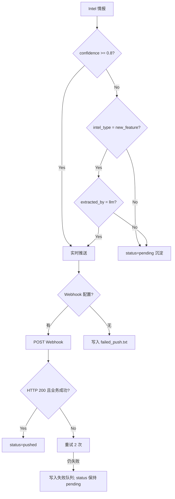

# 推送网关 Spec

## 1. Overview 概述

推送网关（L1-3）是竞品情报 Agent 的输出通道，负责将高置信度情报实时推送至飞书/钉钉，低置信度情报沉淀到 pending 队列，推送失败时降级写入本地文件。推送网关被实时采集流水线和周报工厂共同复用。

本模块对应 PRD 场景 A 的收尾和场景 B 的周报推送，实现功能 A-07（实时推送）、A-08（低置信度沉淀）、B-08（周报推送）、D-06（推送失败重试）。

## 2. Goals & Non-Goals 目标与非目标

### Goals：本期落地范围

- 飞书 Webhook 消息格式化与发送（Must）
- 高置信度情报实时推送（confidence ≥ 0.8，或 new_feature 且 extracted_by=llm）（Must）
- 推送失败重试 2 次 + 本地文件降级（Must）
- 低置信度情报沉淀（confidence < 0.8，status=pending）（Must）
- 钉钉 Webhook 消息适配（Should）

### Non-Goals：明确剔除范围

- 不支持邮件推送（V1）
- 不支持短信推送
- 不支持推送模板自定义（V1 固定格式）
- 不支持已读/未读状态管理
- 不支持推送历史查询 UI
- 飞书失败不自动切换钉钉（需配置优先级）

## 3. Detailed Design 详细设计

### 3.1 功能描述

推送网关包含 3 个子模块：

| 子模块 | L2 ID | 职责 |
|--------|-------|------|
| 消息格式化 | L2-3.1 | 构建飞书/钉钉 Webhook JSON |
| 推送执行 | L2-3.2 | 置信度路由 + HTTP POST + 重试 |
| 低置信度沉淀 | L2-3.2.3 | 不推送，保持 pending 状态 |

### 3.2 置信度路由规则



| 条件 | 动作 |
|------|------|
| confidence ≥ 0.8 | 实时推送 |
| intel_type = new_feature **且** extracted_by = llm | 强制推送（低置信但 LLM 确认的新功能） |
| intel_type = new_feature **且** extracted_by = rule_fallback | **不强制推送**，按 confidence 路由 |
| confidence < 0.8 且不满足强制推送 | 不调用 push；status 保持 pending |
| dedup_status = unchecked | 推送，消息附带 `[未去重]` 标签 |
| push 全部失败 | status **保持 pending**；写入 failed_push |

### 3.3 L3 任务详细设计

#### L3-3.1.1 飞书 Webhook 消息构建 [Must]

**行为：**
- 构建符合飞书 Webhook API v2 规范的消息体
- 使用 `msg_type: "interactive"` 卡片消息（或 `msg_type: "text"` 简化版）
- 消息必含元素：竞品名称、情报类型、标题、摘要、来源链接、置信度标签

**文本消息格式（V1 简化方案）：**

```python
def build_feishu_message(intel: Intel) -> dict:
    type_labels = {
        "new_feature": "新功能",
        "version_update": "版本更新",
        "pricing_change": "定价调整",
        "ui_change": "UI变化",
    }
    dedup_tag = " [未去重]" if intel.dedup_status == "unchecked" else ""
    confidence_tag = f"置信度: {intel.confidence:.0%}"

    text = (
        f"🔔 **{intel.competitor}** | {type_labels.get(intel.intel_type, intel.intel_type)}\n\n"
        f"**{intel.title}**{dedup_tag}\n\n"
        f"{intel.summary}\n\n"
        f"{confidence_tag}\n"
        f"[查看来源]({intel.source_url})"
    )
    return {"msg_type": "text", "content": {"text": text}}
```

**验收：** JSON 符合飞书 Webhook API 规范；POST 后飞书群收到格式正确的消息。

#### L3-3.1.2 钉钉 Webhook 消息构建 [Should]

**行为：**
- 构建符合钉钉机器人 Webhook 规范的消息体
- 使用 `msgtype: "markdown"`
- 消息格式与飞书保持一致（Markdown 语法）

```python
def build_dingtalk_message(intel: Intel) -> dict:
    text = build_feishu_text(intel)  # 复用文本构建
    return {"msgtype": "markdown", "markdown": {"title": intel.title, "text": text}}
```

**钉钉安全设置：** 若配置了加签密钥，需在 URL 中添加 `timestamp` 和 `sign` 参数（V1 可选实现）。

#### L3-3.2.1 高置信度实时推送 [Must]

**行为：**
- 入口函数：`async def push(intel: Intel, webhook: str) -> bool`
- 路由判断：`should_push(intel)` — confidence ≥ 0.8，或 (new_feature 且 extracted_by=llm)
- 不满足条件 → 返回 False，不调 HTTP；**status 不变（pending）**
- Webhook 选择：优先 feishu_webhook，为空则用 dingtalk_webhook
- POST 请求：httpx.AsyncClient，超时 10s
- **飞书成功判定：** HTTP 200 且 JSON 解析后满足 `code == 0` 或 body 含 `"StatusCode":0` 或 `"ok"`
- 成功后：更新 `intel.status = "pushed"`，日志 `pushed`
- **失败后：status 保持 pending**；写入 failed_push 表与 failed_push.txt

```python
def should_push(intel: Intel) -> bool:
    if intel.confidence >= 0.8:
        return True
    if intel.intel_type == "new_feature" and intel.extracted_by == "llm":
        return True
    return False

async def push(intel: Intel, webhook: str) -> bool:
    if not should_push(intel):
        return False

    if not webhook:
        await _fallback_local(intel, "webhook_not_configured")
        return False

    message = build_feishu_message(intel)
    return await _send_with_retry(webhook, message, intel)
```

#### L3-3.2.2 推送失败重试与本地降级 [Must]

**行为：**
- 使用 tenacity：失败重试 2 次，间隔 5s
- 触发条件：HTTP 非 200、超时、连接失败
- 全部失败后：
  1. 写入 `data/failed_push.txt`（追加模式），含时间、标题、摘要、失败原因
  2. 写入 `failed_push` 数据库表（SPEC-2026-070）
  3. 日志 error `push_failed`
- 周报模块会查询 failed_push 表，在周报中体现失败推送

```python
@retry(stop=stop_after_attempt(2), wait=wait_fixed(5), reraise=True)
async def _send_with_retry(webhook: str, message: dict, intel: Intel) -> bool:
    async with httpx.AsyncClient(timeout=10) as client:
        resp = await client.post(webhook, json=message)
        resp.raise_for_status()
        if not _is_feishu_success(resp):
            raise ValueError(f"webhook business error: {resp.text[:200]}")
        db.update_intel_status(intel.id, "pushed")
        logger.info("pushed", intel_id=intel.id)
        return True

def _is_feishu_success(resp: httpx.Response) -> bool:
    if resp.status_code != 200:
        return False
    try:
        data = resp.json()
        if data.get("code") == 0:
            return True
    except Exception:
        pass
    body = resp.text
    return '"StatusCode":0' in body or '"ok"' in body
```

**failed_push.txt 格式：**
```
2026-05-30T10:30:00Z | competitor_a | Product V2.0 Launch | HTTP 500: Internal Server Error
```

#### L3-3.2.3 低置信度沉淀队列 [Must]

**行为：**
- `should_push(intel)` 返回 False 时 → 不调用 push()；Intel 保持 status=pending
- 典型场景：confidence < 0.8 且非 (new_feature + llm)
- 周报模块（SPEC-2026-040）可查询 pending 情报并纳入周报
- 人工审核工具（SPEC-2026-050 L3-5.4.1）可确认后触发推送

### 3.4 周报推送复用

周报工厂（L1-4）生成 Markdown 后，调用推送网关发送：

```python
async def push_weekly_report(content: str, webhook: str) -> bool:
    message = {
        "msg_type": "text",
        "content": {"text": content[:4000]}  # 飞书消息长度限制
    }
    return await _send_with_retry(webhook, message, intel=None)
```

- 周报消息不受置信度路由影响，直接推送
- 超长周报（> 4000 字）截断并附带 "完整周报见 reports/weekly/"

## 4. Technical Constraints 技术约束

| 约束 | 值 |
|------|-----|
| HTTP 客户端 | httpx ≥ 0.27 |
| 推送超时 | 10s/次 |
| 重试次数 | 2 次，间隔 5s |
| 推送延迟 SLO | 情报发现后 30 秒内 |
| 飞书消息最大长度 | 4000 字符（text 类型） |
| Webhook URL 脱敏 | 日志仅显示末 4 位 |

## 5. Error Handling 异常错误处理

| 异常 | 处理 | 降级 |
|------|------|------|
| Webhook URL 为空 | 不发起请求 | 写入 failed_push.txt |
| HTTP 4xx | 不重试 | 写入失败队列 |
| HTTP 5xx | 重试 2 次 | 写入失败队列 |
| 连接超时 | 重试 2 次 | 写入失败队列 |
| 消息超长 | 截断至 4000 字 | 正常发送截断版 |
| confidence 不够 | 不推送 | status 保持 pending |

## 6. Acceptance Criteria 验收标准

**AC-1：高置信度推送**

- Given：Intel confidence=0.9，配置有效 feishu_webhook
- When：调用 push(intel, webhook)
- Then：飞书群 30 秒内收到消息；含标题、摘要、来源链接；status 更新为 pushed

**AC-2：new_feature + llm 强制推送**

- Given：Intel confidence=0.5，intel_type=new_feature，extracted_by=llm
- When：调用 push(intel, webhook)
- Then：消息正常推送（不受置信度限制）；status=pushed

**AC-3：new_feature + rule_fallback 不强制推送**

- Given：Intel intel_type=new_feature，extracted_by=rule_fallback，confidence=0.5
- When：调用 push()
- Then：返回 False；不发起 HTTP；status 保持 pending

**AC-4：推送失败 status 不变**

- Given：Webhook 连续 2 次返回 500
- When：调用 push()
- Then：status **保持 pending**；failed_push 表有记录；不更新为 pushed

**AC-4b：推送重试成功**

- Given：Webhook 第 1 次返回 500，第 2 次返回 200 且 code=0
- When：调用 push()
- Then：共 2 次 HTTP 请求；第 2 次成功；status=pushed

**AC-5：推送全部失败降级**

- Given：Webhook 连续 2 次返回 500
- When：调用 push()
- Then：data/failed_push.txt 追加 1 行；failed_push 表有记录；日志 push_failed

**AC-6：Webhook 未配置**

- Given：feishu_webhook 和 dingtalk_webhook 均为空
- When：调用 push(intel, "")
- Then：不发起 HTTP；写入 failed_push.txt；日志 webhook_not_configured

**AC-7：飞书消息格式**

- Given：构造 Intel 对象
- When：build_feishu_message(intel)
- Then：返回合法 JSON；msg_type=text；content.text 含竞品名、类型标签、标题、摘要、链接

**AC-8：未去重标签**

- Given：Intel dedup_status=unchecked
- When：推送消息
- Then：消息文本含 `[未去重]` 标签

**AC-9：周报推送**

- Given：Markdown 周报内容 2000 字
- When：push_weekly_report(content, webhook)
- Then：飞书收到完整 Markdown 内容

## 7. Context References 参考依赖

| 类型 | 引用 |
|------|------|
| 系统 Spec | SPEC-2026-001 |
| 配置 Spec | SPEC-2026-050（Webhook URL） |
| 韧性 Spec | SPEC-2026-060（重试策略） |
| 存储 Spec | SPEC-2026-070（failed_push 表、status 更新） |
| 处理 Spec | SPEC-2026-020（Intel 输入、confidence 路由） |
| 周报 Spec | SPEC-2026-040（周报推送调用方） |
| 代码文件 | `intel/push.py` |

## 8. Open Questions 待定问题

| # | 问题 | 建议 |
|---|------|------|
| Q-1 | 飞书 text vs interactive 卡片 | V1 用 text 简化，V2 改卡片 |
| Q-2 | 钉钉加签认证 | 若用户使用加签机器人，V1.1 支持 |

## 9. Changelog 变更履历

| 日期 | 版本 | 修改内容 | 修改人 |
|------|------|----------|--------|
| 2026-05-30 | 1.0 | 初稿创建 | Product Team |
| 2026-05-30 | 1.2 | P0/P1：new_feature 强推需 extracted_by=llm；push 失败保持 pending；飞书响应解析 | Product Team |
