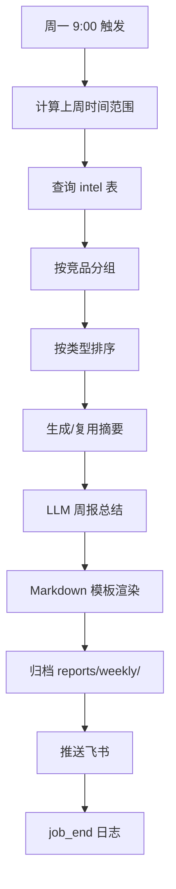

# 周报工厂 Spec

## 1. Overview 概述

周报工厂（L1-4）负责每周一 9:00 自动汇总上周全部竞品情报（含已推送和 pending 队列），按竞品分组、按类型排序，生成结构化 Markdown 周报并推送。周报是产品经理回顾一周竞品动态的核心输出，也是低置信度情报的主要展示渠道。

本模块对应 PRD 场景 B（周报生成与推送），实现功能 B-01 至 B-08。

## 2. Goals & Non-Goals 目标与非目标

### Goals：本期落地范围

- 每周一 9:00 定时触发（Must）
- 上周一 00:00 至周日 23:59 时间范围筛选（Must）
- 按竞品分组（Must）
- 情报摘要复用/LLM 生成（Must）
- Markdown 格式化（Must）
- 周报推送（Must）
- 按情报类型排序（Should）
- LLM 周报总结生成（Should）

### Non-Goals：明确剔除范围

- 不支持 PDF 格式周报（Could Have / V2）
- 不支持周报历史对比（Could Have）
- 不支持情报趋势统计图表
- 错过周一 9:00 不补发
- 不支持自定义周报模板（V1 固定模板）

## 3. Detailed Design 详细设计

### 3.1 功能描述

周报工厂包含 3 个子模块：

| 子模块 | L2 ID | 职责 |
|--------|-------|------|
| 周报数据聚合 | L2-4.1 | 时间筛选 + 竞品分组 + 类型排序 |
| 周报内容生成 | L2-4.2 | 摘要复用/生成 + LLM 总结 + Markdown 渲染 |
| 周报推送 | L2-4.3 | 定时触发 + 推送 |

### 3.2 时间范围计算

遵循 SPEC-2026-001 §3.8：**在配置时区计算自然周，转换为 UTC 后查询数据库。**

```python
from datetime import datetime, timedelta, timezone
from zoneinfo import ZoneInfo

def to_utc_iso(dt: datetime) -> str:
    return dt.astimezone(timezone.utc).strftime("%Y-%m-%dT%H:%M:%SZ")

def get_last_week_range(timezone: str = "Asia/Shanghai") -> tuple[str, str, str, str]:
    """返回 (week_start_local, week_end_local, week_start_utc, week_end_utc)"""
    tz = ZoneInfo(timezone)
    now = datetime.now(tz)
    days_since_monday = now.weekday()  # 0=Monday
    last_monday = (now - timedelta(days=days_since_monday + 7)).replace(
        hour=0, minute=0, second=0, microsecond=0
    )
    week_end_local = last_monday + timedelta(days=6, hours=23, minutes=59, seconds=59)
    week_start_utc = to_utc_iso(last_monday)
    week_end_utc = to_utc_iso(week_end_local)
    week_start_display = last_monday.strftime("%Y-%m-%d")
    week_end_display = week_end_local.strftime("%Y-%m-%d")
    return week_start_display, week_end_display, week_start_utc, week_end_utc
```

**边界：**
- 时区由 `SETTINGS.timezone` 配置（默认 Asia/Shanghai）
- 周一 9:00 触发时，"上周"指触发日的前一个自然周
- **SQL 查询必须使用 week_start_utc / week_end_utc**，禁止使用带 +08:00 的字符串直接 BETWEEN

### 3.3 L3 任务详细设计

#### L3-4.1.1 时间范围筛选 [Must]

**行为：**
- 调用 `get_last_week_range()` 获取展示用日期和 **UTC 查询边界**
- 查询 `intel` 表：`discovered_at BETWEEN week_start_utc AND week_end_utc`（UTC Z 字符串）
- 包含 status=pushed 和 status=pending 的记录
- 不包含 status=rejected 的记录
- 无遗漏、无跨界

#### L3-4.1.2 按竞品分组 [Must]

**行为：**
- 将查询结果按 competitor 字段分组
- 3 个竞品各一个分组，使用配置中的 name 作为展示名
- 某竞品无情报 → 返回空列表，周报中仍显示该竞品标题和"本周无新情报"

```python
from collections import defaultdict

def group_by_competitor(intels: list[Intel], competitors: list) -> dict:
    groups = defaultdict(list)
    for intel in intels:
        groups[intel.competitor].append(intel)
    # 确保 3 个竞品都出现
    for comp in competitors:
        groups.setdefault(comp.id, [])
    return dict(groups)
```

#### L3-4.1.3 情报类型排序 [Should]

**行为：**
- 同一竞品内，按情报类型优先级排序：
  1. new_feature（新功能）
  2. version_update（版本更新）
  3. pricing_change（定价调整）
  4. ui_change（UI 变化）
- 同类型内按 discovered_at DESC 排序（最新在前）

```python
TYPE_ORDER = {
    "new_feature": 0,
    "version_update": 1,
    "pricing_change": 2,
    "ui_change": 3,
}

def sort_intels(intels: list[Intel]) -> list[Intel]:
    return sorted(intels, key=lambda x: (TYPE_ORDER.get(x.intel_type, 99), -x.discovered_at.timestamp()))
```

#### L3-4.2.1 情报摘要复用/生成 [Must]

**行为：**
- 若 Intel.summary 已存在且长度 > 10 → 直接复用
- 若 summary 为空或过短 → 调用 LLM 生成 ≤ 100 字摘要
- LLM 调用复用 `infra/llm.py`，Prompt 模板：`prompts/v1/summary.j2`
- LLM 失败 → 使用 title 作为摘要降级

#### L3-4.2.2 周报总结生成（LLM）[Should]

**行为：**
- 输入：本周全部情报的 title + summary 列表（≤ 50 条）
- 调用 LLM 生成 ≤ 300 字的周报总结
- Prompt 模板：`prompts/v1/weekly_summary.j2`
- 输出内容：关键发现、趋势、值得关注的点
- LLM 失败 → 跳过总结章节，不阻塞周报生成

```jinja2
{# prompts/v1/weekly_summary.j2 #}
以下是本周竞品情报列表，请生成一份不超过300字的周报总结，包含关键发现、趋势和值得关注的点：


- [{{ intel.competitor }}] {{ intel.title }}: {{ intel.summary }}

```

#### L3-4.2.3 Markdown 格式化 [Must]

**行为：**
- 使用固定模板渲染 Markdown
- 模板变量：week_start, week_end, summary, competitors_groups
- 输出语法正确的 Markdown，飞书可正常渲染

**周报 Markdown 模板：**

```markdown
# 竞品情报周报 {week_start} ~ {week_end}

> 生成时间：{generated_at}
> 本周共 {total_count} 条情报（已推送 {pushed_count} 条，待审核 {pending_count} 条）

## 本周总结

{llm_summary}

---

## {competitor_name}



- **[{type_label}]** {intel.title} — {intel.summary} [{confidence}%] [来源]({intel.source_url})


本周无新情报。


---

## 推送失败记录



- {fp.created_at} | {fp.title} | {fp.error_message}


无推送失败记录。

```

**类型标签映射：**

| intel_type | 展示标签 |
|------------|----------|
| new_feature | 新功能 |
| version_update | 版本更新 |
| pricing_change | 定价调整 |
| ui_change | UI变化 |

#### L3-4.3.1 周一 9:00 定时触发 [Must]

**行为：**
- APScheduler cron 表达式：`day_of_week=mon, hour=9, minute=0`（注册见 SPEC-2026-001 §3.9）
- 使用 `SETTINGS.timezone` 时区
- 到点触发 `job_weekly()`，日志 `job_start type=weekly`
- 错过时间不补发（如进程未运行）
- 与采集任务独立，互不阻塞

```python
scheduler.add_job(
    job_weekly, "cron",
    day_of_week="mon", hour=9, minute=0,
    timezone=SETTINGS.timezone,
    id="weekly"
)
```

#### L3-4.3.2 Markdown 周报推送 [Must]

**行为：**
- 调用 SPEC-2026-030 的 `push_weekly_report(content, webhook)`
- 推送成功后归档到 `reports/weekly/{week_start}.md`（SPEC-2026-070）
- 飞书收到完整 Markdown，链接可点击，排版正常
- 推送失败 → 周报仍写入本地文件，日志 warning

### 3.4 完整周报生成流程



```python
async def generate_and_push(webhook: str) -> Weekly:
    week_start, week_end, start_utc, end_utc = get_last_week_range(SETTINGS.timezone)
    intels = db.get_intel_by_time_range(start_utc, end_utc)
    groups = group_by_competitor(intels, SETTINGS.competitors)

    for comp_id in groups:
        groups[comp_id] = sort_intels(groups[comp_id])
        for intel in groups[comp_id]:
            if len(intel.summary) <= 10:
                intel.summary = await llm.generate_summary(intel)

    llm_summary = await llm.generate_weekly_summary(intels)
    failed_pushes = db.get_unresolved_failed_pushes()
    content = render_weekly_markdown(week_start, week_end, groups, llm_summary, failed_pushes)

    weekly = Weekly(week_start=week_start, week_end=week_end, content=content)
    Path(f"reports/weekly/{week_start}.md").write_text(content, encoding="utf-8")
    await push.push_weekly_report(content, webhook)
    return weekly
```

## 4. Technical Constraints 技术约束

| 约束 | 值 |
|------|-----|
| 触发时间 | 每周一 09:00（SETTINGS.timezone） |
| 时间范围 | 配置时区下上周一 00:00 ~ 周日 23:59；**SQL 用 UTC 边界** |
| 摘要最大长度 | 100 字（LLM 生成） |
| 总结最大长度 | 300 字（LLM 生成） |
| 周报归档路径 | reports/weekly/{YYYY-MM-DD}.md |
| 推送通道 | 复用 SPEC-2026-030 |
| LLM 模型 | gpt-4o-mini（复用 infra/llm.py） |

## 5. Error Handling 异常错误处理

| 异常 | 处理 | 结果 |
|------|------|------|
| 上周无情报 | 正常生成空周报 | 3 个竞品均显示"本周无新情报" |
| LLM 摘要生成失败 | 使用 title 降级 | 周报仍生成 |
| LLM 总结生成失败 | 跳过总结章节 | 周报仍生成和推送 |
| 推送失败 | 周报写入本地文件 | 日志 warning，不阻塞 |
| DB 查询失败 | 日志 error，跳过本次周报 | 下次周一重试 |
| 进程未运行错过触发 | 不补发 | 日志无记录 |

## 6. Acceptance Criteria 验收标准

**AC-1：时间范围准确**

- Given：当前为 2026-06-02（周一）10:00 Asia/Shanghai
- When：调用 get_last_week_range("Asia/Shanghai")
- Then：week_start="2026-05-26"，week_end="2026-06-01"；week_start_utc="2026-05-25T16:00:00Z"（周一 00:00 CST = 周日 16:00 UTC）；week_end_utc 覆盖周日 23:59 CST

**AC-1b：UTC 查询无跨界**

- Given：intel.discovered_at="2026-05-25T15:59:59Z"（周一 00:00 CST 前 1 秒）
- When：用上周 UTC 边界查询
- Then：该记录**不在**结果中

**AC-2：包含 pending 情报**

- Given：上周有 3 条 pushed + 2 条 pending 情报
- When：查询上周情报
- Then：返回 5 条记录；不包含 rejected 记录

**AC-3：竞品分组**

- Given：上周 10 条情报分布在 3 个竞品
- When：group_by_competitor()
- Then：3 个分组各有对应情报；空竞品返回空列表

**AC-4：类型排序**

- Given：competitor_a 有 ui_change、new_feature、version_update 各 1 条
- When：sort_intels()
- Then：顺序为 new_feature → version_update → ui_change

**AC-5：摘要复用**

- Given：Intel.summary 已有 50 字内容
- When：生成周报
- Then：不调用 LLM；直接使用已有 summary

**AC-6：Markdown 格式正确**

- Given：2 个竞品各 3 条情报
- When：render_weekly_markdown()
- Then：输出含标题、分组、列表、链接；Markdown 语法正确；飞书可渲染

**AC-7：周一 9:00 触发**

- Given：进程运行中，时区 Asia/Shanghai
- When：周一 9:00 到达
- Then：日志 job_start type=weekly；9:05 前飞书收到周报

**AC-8：错过不补发**

- Given：进程周一 8:00 停止，10:00 重启
- When：重启后
- Then：不补发上周周报；等下个周一正常触发

**AC-9：周报归档**

- Given：周报生成成功
- When：检查文件系统
- Then：reports/weekly/{week_start}.md 存在且内容完整

**AC-10：推送失败记录纳入周报**

- Given：本周有 2 条推送失败记录
- When：生成周报
- Then：周报末尾"推送失败记录"章节含 2 条记录

## 7. Context References 参考依赖

| 类型 | 引用 |
|------|------|
| 系统 Spec | SPEC-2026-001（Weekly 模型、时区配置） |
| 处理 Spec | SPEC-2026-020（Intel 数据格式） |
| 推送 Spec | SPEC-2026-030（push_weekly_report） |
| 存储 Spec | SPEC-2026-070（情报查询、周报归档、failed_push） |
| 配置 Spec | SPEC-2026-050（timezone、competitor name） |
| 代码文件 | `intel/weekly.py`, `prompts/v1/weekly_summary.j2`, `scheduler.py` |

## 8. Open Questions 待定问题

| # | 问题 | 建议 |
|---|------|------|
| Q-1 | 空周报是否推送 | 建议推送，让 PM 确认系统正常运行 |
| Q-2 | 周报是否包含 rejected 情报 | 不包含，仅 pushed + pending |

## 9. Changelog 变更履历

| 日期 | 版本 | 修改内容 | 修改人 |
|------|------|----------|--------|
| 2026-05-30 | 1.0 | 初稿创建 | Product Team |
| 2026-05-30 | 1.1 | P0 修订：UTC 存储 + 时区边界转换查询（对齐 SPEC-2026-001 §3.8） | Product Team |
