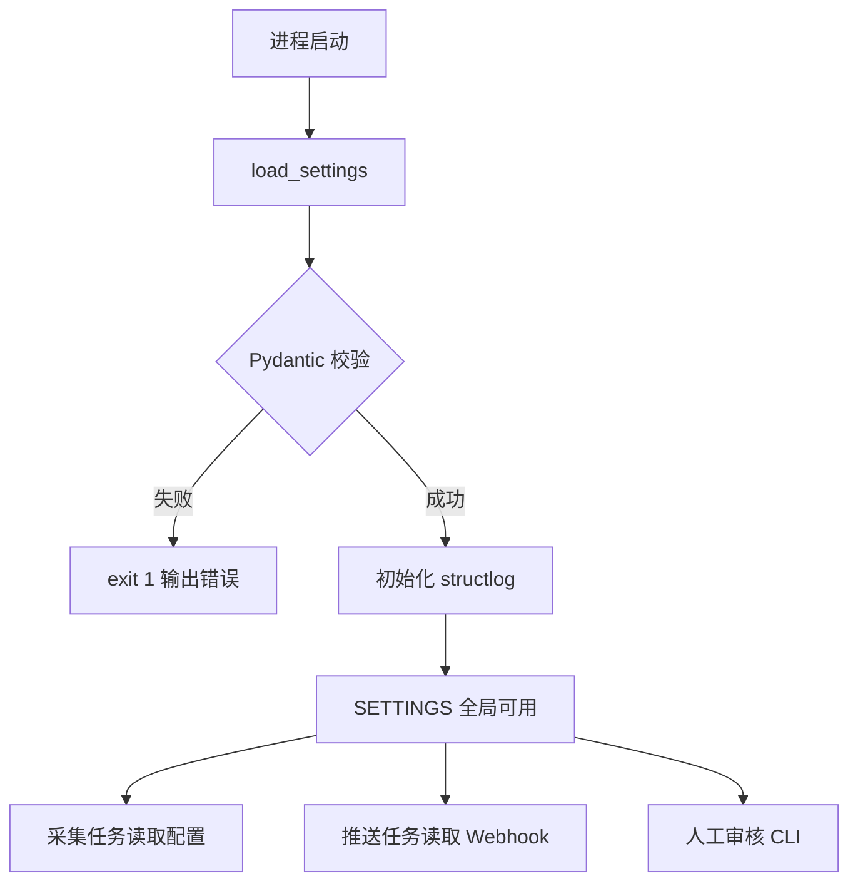

# 配置与运维中心 Spec

## 1. Overview 概述

配置与运维中心（L1-5）是竞品情报 Agent 的基础设施模块，负责竞品信息源配置管理、推送渠道配置、结构化运行日志记录，以及低置信度情报的人工审核入口。所有业务模块在启动时依赖本模块加载配置，在运行时被本模块的日志系统贯穿观测。

本模块对应 PRD 场景 C（配置与运维），实现功能 C-01（信息源配置）、C-02（推送渠道配置）、C-03（运行日志）、C-04（人工审核入口）。

## 2. Goals & Non-Goals 目标与非目标

### Goals：本期落地范围

- YAML 配置文件 Schema 定义与 Pydantic 校验（Must）
- 启动时加载配置，错误配置阻止启动（Must）
- structlog 结构化 JSON 日志，记录采集耗时和 Token 消耗（Must）
- 飞书/钉钉 Webhook 配置读取（Should）
- 日志按天分割、14 天 gzip 归档、30 天删除（Should）
- 命令行审核工具 `scripts/review_pending.py`（Should）

### Non-Goals：明确剔除范围

- 不支持配置热更新（修改后需重启进程）
- 不提供 Web 配置界面
- 不实现多环境配置切换（dev/staging/prod）
- 不实现日志远程采集（ELK/Datadog 等）
- 不记录 API Key 明文到日志

## 3. Detailed Design 详细设计

### 3.1 功能描述

本模块包含 4 个子功能：

1. **竞品配置管理（L2-5.1）**：解析和校验 `config/competitors.yaml`
2. **推送渠道配置（L2-5.2）**：读取 Webhook URL，空值时降级
3. **可观测性（L2-5.3）**：structlog 结构化日志 + 日志轮转
4. **人工审核（L2-5.4）**：CLI 工具审核 pending 队列

### 3.2 数据模型

#### 3.2.1 配置文件完整 Schema

```yaml
# config/competitors.yaml

# 全局设置
interval_minutes: 60          # 采集间隔，范围 15-120，默认 60
cold_start_days: 7            # RSS 冷启动窗口，仅处理 N 天内 published 的 entry
timezone: "Asia/Shanghai"     # IANA 时区
feishu_webhook: ""            # 飞书机器人 Webhook URL
dingtalk_webhook: ""          # 钉钉机器人 Webhook URL（可选）

# 搜索 API 配置（Should）
search:
  enabled: false
  provider: "serpapi"           # serpapi | bing | google
  api_key_env: "SEARCH_API_KEY"
  keywords:                     # 全局搜索关键词
    - "competitor product update"
  max_results: 5

# 竞品列表（固定 3 个）
competitors:
  - id: competitor_a            # 必填，唯一标识，字母数字下划线
    name: "竞品 A（占位）"       # 必填，展示名称
    enabled: true               # 可选，默认 true
    sources:                    # 必填，至少 1 个源
      - type: rss               # rss | http | search
        url: "https://example.com/competitor_a/feed.xml"
        name: ""                # 可选，http 源必填
      - type: http
        url: "https://example.com/competitor_a/changelog"
        name: "更新日志"

  - id: competitor_b
    name: "竞品 B（占位）"
    enabled: true
    sources:
      - type: rss
        url: "https://example.com/competitor_b/blog/feed.xml"

  - id: competitor_c
    name: "竞品 C（占位）"
    enabled: true
    sources:
      - type: http
        url: "https://example.com/competitor_c/changelog"
        name: "版本更新"
```

#### 3.2.2 Pydantic 配置模型

```python
# config/settings.py

from pydantic import BaseModel, Field, HttpUrl, field_validator
from pydantic_settings import BaseSettings
from typing import Literal

class SourceConfig(BaseModel):
    type: Literal["rss", "http", "search"]
    url: HttpUrl
    name: str = ""

    @field_validator("name")
    @classmethod
    def http_requires_name(cls, v, info):
        if info.data.get("type") == "http" and not v:
            raise ValueError("http 类型源必须提供 name 字段")
        return v

class CompetitorConfig(BaseModel):
    id: str = Field(pattern=r"^[a-z][a-z0-9_]*$")
    name: str = Field(min_length=1)
    enabled: bool = True
    sources: list[SourceConfig] = Field(min_length=1)

class SearchConfig(BaseModel):
    enabled: bool = False
    provider: Literal["serpapi", "bing", "google"] = "serpapi"
    api_key_env: str = "SEARCH_API_KEY"
    keywords: list[str] = []
    max_results: int = Field(default=5, ge=1, le=20)

class AppSettings(BaseSettings):
    interval_minutes: int = Field(default=60, ge=15, le=120)
    cold_start_days: int = Field(default=7, ge=1, le=30)
    timezone: str = "Asia/Shanghai"
    feishu_webhook: str = ""
    dingtalk_webhook: str = ""
    search: SearchConfig = SearchConfig()
    competitors: list[CompetitorConfig] = Field(min_length=3, max_length=3)

    @field_validator("competitors")
    @classmethod
    def unique_ids(cls, v):
        ids = [c.id for c in v]
        if len(ids) != len(set(ids)):
            raise ValueError("competitor id 必须唯一")
        return v

def load_settings(path: str = "config/competitors.yaml") -> AppSettings:
    import yaml
    with open(path) as f:
        data = yaml.safe_load(f)
    return AppSettings(**data)
```

### 3.3 L3 任务详细设计

#### L3-5.1.1 YAML 配置 Schema 定义 [Must]

**行为：**
- 使用 Pydantic v2 模型校验 `config/competitors.yaml`
- 校验规则：
  - `competitors` 必须恰好 3 个条目
  - 每个 competitor 必须有 `id`、`name`、`sources`（≥ 1 个）
  - `id` 格式：`^[a-z][a-z0-9_]*$`
  - `interval_minutes` 范围 15–120
  - `cold_start_days` 范围 1–30，默认 7
  - `type` 仅允许 rss / http / search
  - http 类型源必须提供 `name`
  - competitor id 不可重复
- 校验失败时输出 Pydantic ValidationError 详情（字段名 + 错误原因）

#### L3-5.1.2 配置加载与生效 [Must]

**行为：**
- `main.py` 启动时调用 `load_settings()`
- 校验通过 → 赋值全局 `SETTINGS` 单例
- 校验失败 → 打印错误详情，进程 exit(1)
- 配置修改后需重启进程生效（V1 不支持热更新）
- `enabled: false` 的竞品在采集任务中跳过

**边界：**
- 配置文件不存在 → 报错 "config/competitors.yaml not found"，exit(1)
- YAML 语法错误 → 报错具体行号

#### L3-5.2.1 Webhook 配置管理 [Should]

**行为：**
- 读取 `feishu_webhook` 和 `dingtalk_webhook` 字段
- 推送时优先使用 feishu_webhook；若为空则尝试 dingtalk_webhook
- 两者均为空 → 推送降级为写入 `data/failed_push.txt`，日志 warning `webhook_not_configured`
- 日志中 Webhook URL 脱敏：仅显示末 4 位字符

#### L3-5.3.1 结构化日志 [Must]

**行为：**
- 使用 structlog 输出 JSON 格式日志到 `logs/{YYYY-MM-DD}.json`
- 每条日志必含字段：

| 字段 | 类型 | 说明 |
|------|------|------|
| timestamp | ISO8601 | 事件时间 |
| level | string | info / warning / error |
| event | string | 事件名称（如 collect_start, llm_call, pushed） |
| competitor | string? | 竞品 ID |
| source | string? | 信息源 URL |
| status | string? | success / failed / partial_success |
| duration_ms | int? | 耗时毫秒 |
| token_input | int? | LLM 输入 token |
| token_output | int? | LLM 输出 token |
| error | string? | 错误信息 |

- 采集任务 bookend 日志：
  - `job_start`：type=collection, competitors_count=3
  - `job_end`：type=collection, status, duration_ms, intel_new, sources_failed

#### L3-5.3.2 日志轮转与归档 [Should]

**行为：**
- 日志按自然日分割，每天一个 `logs/{YYYY-MM-DD}.json` 文件
- 每日 02:00 定时任务（与 SPEC-2026-070 协作）：
  - 14 天前的 `.json` → gzip 压缩为 `.json.gz`
  - 30 天前的文件（含 .gz）→ 删除

#### L3-5.4.1 命令行审核工具 [Should]

**行为：**
- 脚本路径：`scripts/review_pending.py`
- 运行方式：`python scripts/review_pending.py`
- 功能：
  1. 查询 `intel` 表 status=pending 的记录，按 discovered_at DESC 排列
  2. 逐条展示：ID / 竞品 / 类型 / 标题 / 摘要 / 置信度 / 来源 URL
  3. 用户输入：`y`（确认，status→pushed 并触发推送）/ `n`（驳回，status→rejected）/ `s`（跳过）/ `q`（退出）
  4. 确认后调用推送模块发送通知

**边界：**
- 无 pending 记录 → 输出 "No pending intelligence." 并退出
- 非交互环境（无 TTY）→ 仅列出 pending 列表，不接受输入

### 3.4 业务流程图



## 4. Technical Constraints 技术约束

| 约束 | 值 |
|------|-----|
| 配置格式 | YAML |
| 校验框架 | Pydantic v2 + pydantic-settings v2 |
| 日志框架 | structlog ≥ 24.0 |
| 日志格式 | JSON Lines（每行一条） |
| 配置文件路径 | `config/competitors.yaml`（硬编码，V1 不支持自定义路径） |
| 环境变量 | `OPENAI_API_KEY`（LLM）、`SEARCH_API_KEY`（搜索，可选） |
| 竞品数量 | 固定 3 个，不多不少 |

## 5. Error Handling 异常错误处理

| 异常 | 处理 | 日志 |
|------|------|------|
| YAML 文件不存在 | exit(1) | error: config file not found |
| YAML 语法错误 | exit(1) | error: yaml parse error + 行号 |
| Pydantic 校验失败 | exit(1) | error: validation errors 逐字段输出 |
| competitors 数量 ≠ 3 | exit(1) | error: expected 3 competitors, got N |
| Webhook URL 为空 | 不阻塞启动 | warning: webhook_not_configured |
| 日志目录不可写 | exit(1) | error: cannot create logs/ directory |

## 6. Acceptance Criteria 验收标准

**AC-1：合法配置启动**

- Given：`config/competitors.yaml` 包含 3 个合法竞品配置
- When：调用 load_settings()
- Then：返回 AppSettings 对象；competitors 长度为 3；interval_minutes=60

**AC-2：缺失字段阻止启动**

- Given：YAML 中 competitor_b 缺少 sources 字段
- When：调用 load_settings()
- Then：抛出 ValidationError，错误信息包含 "sources" 字段名

**AC-3：interval_minutes 边界**

- Given：interval_minutes 设为 10
- When：调用 load_settings()
- Then：ValidationError，提示 ge=15 约束

**AC-4：结构化日志字段完整**

- Given：执行一次采集任务
- When：查看 logs/{today}.json
- Then：存在 job_start 和 job_end 事件；包含 timestamp、duration_ms 字段

**AC-5：LLM Token 记录**

- Given：处理模块调用 LLM 成功
- When：查看日志
- Then：存在 llm_call 事件，含 token_input 和 token_output 整数字段

**AC-6：Webhook 空值降级**

- Given：feishu_webhook 和 dingtalk_webhook 均为空
- When：推送模块尝试推送
- Then：不发起 HTTP 请求；日志 warning webhook_not_configured；情报写入 data/failed_push.txt

**AC-7：审核工具列出 pending**

- Given：数据库有 3 条 status=pending 的情报
- When：运行 python scripts/review_pending.py
- Then：展示 3 条记录，含 ID、标题、置信度

**AC-8：enabled=false 跳过采集**

- Given：competitor_b 设置 enabled=false
- When：执行采集任务
- Then：仅采集 competitor_a 和 competitor_c；日志中 competitor_b 不出现

## 7. Context References 参考依赖

| 类型 | 引用 |
|------|------|
| 系统 Spec | SPEC-2026-001 |
| 代码文件 | `config/competitors.yaml`, `config/settings.py`, `infra/log.py` |
| 审核脚本 | `scripts/review_pending.py` |
| 下游消费者 | SPEC-2026-010（读取竞品源）、SPEC-2026-030（读取 Webhook） |
| 存储 | SPEC-2026-070（pending 队列查询） |

## 8. Open Questions 待定问题

| # | 问题 | 建议 |
|---|------|------|
| Q-1 | 是否支持 .env 文件加载环境变量 | 建议使用 python-dotenv，非 V1 必须 |
| Q-2 | 配置文件是否支持 config.local.yaml 覆盖 | V1 不支持，V2 考虑 |

## 9. Changelog 变更履历

| 日期 | 版本 | 修改内容 | 修改人 |
|------|------|----------|--------|
| 2026-05-30 | 1.0 | 初稿创建 | Product Team |
| 2026-05-30 | 1.2 | P1：新增 cold_start_days 配置项（默认 7） | Product Team |
