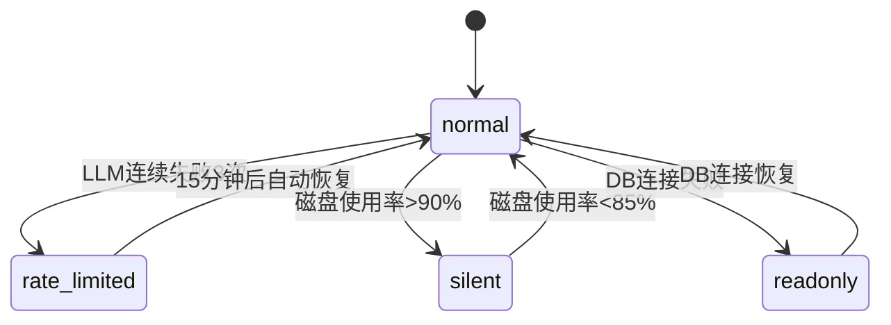

# 韧性保障系统 Spec

## 1. Overview 概述

韧性保障系统（L1-6）是竞品情报 Agent 的横向支撑模块，为采集、处理、推送三个核心链路提供容错、重试和降级能力。设计原则是**单点故障不扩散**：任意单个信息源失败不阻塞其他源，任意单条情报处理失败不阻塞批次内其他情报。

本模块对应 PRD 场景 D（失败处理与降级），实现功能 D-01 至 D-08。

## 2. Goals & Non-Goals 目标与非目标

### Goals：本期落地范围

- 采集层：网络超时指数退避重试（3 次）、HTTP 状态码分层处理（Must）
- LLM 层：API 限流/超时重试（2 次）、规则提取降级（Must）
- LLM 层：非 JSON 返回重试 + pending 队列（Should）
- 推送层：Webhook 失败重试（2 次）+ 本地文件兜底（Must，实现于 L1-3）
- 系统层：任务超时保护 30 分钟（Should）
- 系统层：磁盘空间监控与静默模式（Should）
- 系统层：LLM 连续失败限流模式 15 分钟（Should）

### Non-Goals：明确剔除范围

- 不做熔断器（Circuit Breaker）的完整实现（V1 仅简单计数限流）
- 不做分布式重试队列（无 Redis/RabbitMQ）
- 不做自动恢复后补发历史遗漏情报
- 不做推送渠道的自动切换（飞书失败不自动切钉钉）

## 3. Detailed Design 详细设计

### 3.1 功能描述

韧性保障按层级提供 4 组能力：

| 层级 | 职责 | 覆盖模块 |
|------|------|----------|
| 采集层容错（L2-6.1） | HTTP 重试、状态码分层 | L1-1 |
| LLM 层降级（L2-6.2） | API 重试、规则提取、JSON 修复 | L1-2 |
| 系统级保护（L2-6.3） | 任务超时、磁盘监控、LLM 限流 | 全局 |
| 推送层容错 | Webhook 重试 | L1-3（交叉引用） |

### 3.2 降级模式状态机



| 模式 | 触发条件 | 行为 | 恢复条件 |
|------|----------|------|----------|
| normal | 默认 | 全功能运行 | — |
| rate_limited | LLM 连续失败 3 次 | 暂停 LLM 调用 15 分钟，仅规则提取 | 15 分钟后自动恢复 |
| silent | 磁盘使用率 > 90% | 停止写入 storage/raw/，继续推送和 DB 写入 | 磁盘 < 85% |
| readonly | SQLite 连接失败 | 新情报暂存 data/pending_import/ | DB 恢复后批量导入 |

### 3.3 L3 任务详细设计

#### L3-6.1.1 网络超时重试 [Must]

**行为：**
- 使用 tenacity 装饰器实现指数退避
- 触发条件：`httpx.ConnectTimeout`、`httpx.ReadTimeout`、`httpx.ConnectError`
- 重试策略：最多 3 次，间隔 1s → 2s → 4s
- 全部失败后：记录错误日志（含 source URL、重试次数），标记该源 status=failed，**继续处理下一个源**

```python
@retry(
    stop=stop_after_attempt(3),
    wait=wait_exponential(multiplier=1, min=1, max=4),
    retry=retry_if_exception_type((httpx.ConnectTimeout, httpx.ReadTimeout, httpx.ConnectError)),
    before_sleep=before_sleep_log(logger, logging.WARNING)
)
async def fetch_with_retry(url: str) -> httpx.Response: ...
```

**边界：**
- DNS 解析失败视为 ConnectError，同样重试
- 单次请求超时上限 10s（含重试总时间 ≤ 30s）

#### L3-6.1.2 HTTP 状态码分层处理 [Must]

**行为：**

| 状态码范围 | 策略 | 后续动作 |
|------------|------|----------|
| 2xx | 正常处理 | 解析内容 |
| 4xx（含 404） | 不重试 | 记录错误；404 额外标记源 config 中 `last_error=404`，日志 warning source_not_found |
| 5xx | 重试 2 次，间隔 2s | 仍失败则记录错误，继续下一源 |

- 每次 HTTP 响应均记录日志：`http_response`，含 status_code、url、retry_count、decision

**边界：**
- 3xx 重定向：httpx 默认跟随，最多 5 次跳转
- 429 Too Many Requests：视为 5xx，重试 2 次

#### L3-6.2.0 LLM Provider 抽象层 [Must]

**行为：**
- 定义 `LLMProvider` Protocol（`infra/llm/base.py`）：统一 `chat()` 接口
- `OpenAICompatProvider`（`infra/llm/providers/openai_compat.py`）适配 OpenAI 兼容 Chat Completions API
- `factory.create_provider()` 按 SPEC-2026-050 `llm` 配置实例化 Provider
- 业务层（020/040）仅调用 `infra/llm` 门面（`extract` / `generate_summary` / `generate_weekly_summary`）
- 规则降级 `_rule_extract` 位于 `infra/llm/fallback.py`，与 Provider 实现解耦

**扩展原则：** 新增后端 = 注册 preset 或实现 Provider 类，业务模块零改动

| 组件 | 路径 | 职责 |
|------|------|------|
| LLMProvider | infra/llm/base.py | Protocol |
| OpenAICompatProvider | infra/llm/providers/openai_compat.py | API 调用 + 重试 |
| factory | infra/llm/factory.py | preset 注册表 |
| fallback | infra/llm/fallback.py | 规则降级 |

#### L3-6.2.1 LLM API 重试（Provider 层）[Must]

**行为：**
- 触发条件：OpenAI 兼容 API 返回 429（Rate Limit）、408（Timeout）、500/502/503
- 重试策略：最多 2 次，间隔 2s（固定）
- 使用 tenacity 装饰 `OpenAICompatProvider.chat()`
- 每次调用记录 token 消耗（成功或失败均记录）；日志含 `provider` 字段

```python
@retry(
    stop=stop_after_attempt(2),
    wait=wait_fixed(2),
    retry=retry_if_exception_type((openai.RateLimitError, openai.APITimeoutError, openai.APIConnectionError)),
    reraise=True
)
async def chat(self, messages, *, max_tokens, json_mode=False): ...
```

#### L3-6.2.2 规则提取降级 [Must]

**行为：**
- 触发条件：Provider 不可用（无 API Key）或 `chat()` 重试 2 次后仍失败
- 降级逻辑（`rule_extract`）：

```python
def _rule_extract(raw: RawDoc) -> dict:
    text = (raw.title + " " + raw.content).lower()
    TYPE_KEYWORDS = {
        "new_feature": ["新功能", "launch", "introducing", "new feature", "发布"],
        "version_update": ["版本", "version", "update", "release", "changelog"],
        "pricing_change": ["定价", "价格", "pricing", "price", "plan"],
        "ui_change": ["界面", "ui", "design", "redesign", "交互"],
    }
    intel_type = "version_update"  # 默认
    for itype, keywords in TYPE_KEYWORDS.items():
        if any(kw in text for kw in keywords):
            intel_type = itype
            break
    return {
        "intel_type": intel_type,
        "title": raw.title[:50],
        "summary": raw.content[:100],
        "_source": "rule_fallback"
    }
```

- 降级输出标记 `_source: "rule_fallback"`；process 写入 `extracted_by=rule_fallback`
- 降级情报 intel_type 标记为"待确认"（通过 confidence ≤ 0.6 体现）
- **不触发 new_feature 强制推送**（见 SPEC-2026-030 should_push）

#### L3-6.2.3 JSON 格式失败处理 [Should]

**行为：**
- LLM 返回内容非合法 JSON 时：
  1. 第 1 次：重试 1 次，Prompt 追加 "You MUST return valid JSON only."
  2. 仍失败：保存原始 LLM 响应到 `storage/raw/llm_failures/{id}.txt`
  3. 创建 Intel 记录：title=raw.title, summary="[LLM提取失败，待人工审核]", confidence=0.3, status=pending
- 不抛异常，不阻塞批次

#### L3-6.3.1 任务超时保护 [Should]

**行为：**
- 采集任务（job_collect）整体超时：30 分钟
- 实现：`asyncio.wait_for(job_collect(), timeout=1800)`
- 超时后：取消所有未完成的 asyncio Task，记录 run_log status=timeout，日志 error
- 下次调度正常触发（不补发）

#### L3-6.3.2 磁盘空间监控 [Should]

**行为：**
- 每小时检查一次磁盘使用率（`shutil.disk_usage`）
- 使用率 > 80%：日志 warning `disk_warning`，level=warning
- 使用率 > 90%：进入 silent 模式，日志 error `silent_mode_enabled`
- silent 模式下：跳过 storage/raw/ 写入，DB 和推送正常
- 使用率 < 85%：退出 silent 模式，日志 info `silent_mode_disabled`

#### L3-6.3.3 LLM 限流模式 [Should]

**行为：**
- 维护全局计数器 `llm_consecutive_failures`（内存变量）
- LLM 调用失败 → 计数 +1；成功 → 计数归零
- 计数 ≥ 3 → 进入 rate_limited 模式，持续 15 分钟
- rate_limited 模式下：所有 LLM 调用跳过 Provider，直接 `rule_extract`
- 15 分钟后自动恢复 normal，计数归零
- 日志事件：`rate_limit_mode_enabled` / `rate_limit_mode_disabled`

#### L3-6.4.1 去重超时降级 [Should]

**行为（交叉引用 SPEC-2026-020）：**
- 历史库查询超过 5 秒未返回 → 跳过去重检查
- Intel.dedup_status 设为 `unchecked`
- 推送消息附带标签 `[未去重]`
- 日志 warning `dedup_timeout`

### 3.4 重试策略汇总表

| 场景 | 重试次数 | 间隔 | 最终降级 |
|------|----------|------|----------|
| 网络超时/连接失败 | 3 | 1s/2s/4s 指数退避 | 标记源失败，继续下一源 |
| HTTP 5xx | 2 | 2s 固定 | 标记源失败，继续下一源 |
| HTTP 4xx | 0 | — | 标记源失败，404 额外告警 |
| LLM 429/超时 | 2 | 2s 固定 | 规则提取降级 |
| LLM 非 JSON | 1 | 立即 | pending 队列 |
| Webhook 推送失败 | 2 | 5s 固定 | 写入 failed_push |
| 去重查询超时 | 0 | — | 跳过去重，标记 unchecked |

## 4. Technical Constraints 技术约束

| 约束 | 值 |
|------|-----|
| 重试库 | tenacity ≥ 8.0 |
| HTTP 超时 | 单次 10s，含重试总上限 30s |
| LLM 超时 | 单次 30s |
| 任务总超时 | 30 分钟 |
| 限流模式持续时间 | 15 分钟 |
| 磁盘告警/静默阈值 | 80% / 90% |
| 降级模式状态 | 进程内存变量，重启后恢复 normal |

## 5. Error Handling 异常错误处理

| 异常 | 层级 | 处理 |
|------|------|------|
| 单源采集失败 | 采集 | 捕获异常，日志 error，继续下一源 |
| 单条情报处理失败 | 处理 | 捕获异常，日志 error，继续下一条 |
| 批次内全部源失败 | 采集 | run_log status=failed，不触发推送 |
| LLM 限流模式激活 | 处理 | 所有 LLM 调用走规则降级 |
| 磁盘静默模式 | 存储 | 跳过 Raw HTML 写入 |
| DB 连接失败 | 存储 | 进入 readonly，暂存本地 JSON |

**日志要求：** 每次重试均记录 `retry_attempt` 事件，含 attempt_number、exception_type、next_wait_seconds。

## 6. Acceptance Criteria 验收标准

**AC-1：网络超时重试**

- Given：模拟目标 URL 第 1、2 次 ConnectTimeout，第 3 次成功
- When：调用 fetch_with_retry()
- Then：最终返回 200 响应；日志有 2 条 retry_attempt warning

**AC-2：网络超时全部失败**

- Given：模拟目标 URL 连续 3 次 ConnectTimeout
- When：调用 fetch_with_retry()
- Then：抛出异常；日志 error 含 source URL 和 "3 attempts failed"

**AC-3：HTTP 404 不重试**

- Given：目标 URL 返回 404
- When：HTTP 客户端请求
- Then：仅 1 次请求；日志 decision=no_retry, status_code=404

**AC-4：HTTP 502 重试**

- Given：目标 URL 第 1 次返回 502，第 2 次返回 200
- When：HTTP 客户端请求
- Then：共 2 次请求；最终成功

**AC-5：LLM 降级规则提取**

- Given：模拟 LLM API 连续 2 次返回 429；或 Provider 不可用（无 API Key）
- When：调用 extract(raw_doc)
- Then：返回 rule_fallback 结果；intel_type 基于关键词判定；confidence ≤ 0.6；不可用时零 API 请求

**AC-6：单源失败不阻塞**

- Given：3 个竞品 6 个源，competitor_a 的 RSS 源超时失败
- When：执行 collect_all()
- Then：competitor_b 和 competitor_c 的源正常返回；competitor_a 的 HTTP 源正常返回

**AC-7：LLM 限流模式**

- Given：连续 3 次 LLM 调用失败
- When：第 4 次调用 extract()
- Then：不发起 API 请求；直接返回 rule_fallback；日志 rate_limit_mode_enabled

**AC-8：磁盘静默模式**

- Given：磁盘使用率 92%
- When：采集模块尝试写入 Raw HTML
- Then：跳过文件写入；DB 和推送正常；日志 silent_mode_enabled

**AC-9：任务超时保护**

- Given：模拟采集任务执行超过 30 分钟
- When：asyncio.wait_for 触发 TimeoutError
- Then：任务被取消；run_log status=timeout；下次调度正常触发

## 7. Context References 参考依赖

| 类型 | 引用 |
|------|------|
| 系统 Spec | SPEC-2026-001 |
| 存储 Spec | SPEC-2026-070（磁盘监控、readonly 模式） |
| 采集 Spec | SPEC-2026-010（HTTP 重试消费方） |
| 处理 Spec | SPEC-2026-020（LLM 降级消费方） |
| 推送 Spec | SPEC-2026-030（Webhook 重试） |
| 代码文件 | `infra/llm/`（Provider + 重试 + 降级）、tenacity 装饰器用于 `intel/collect.py` |
| 配置 Spec | SPEC-2026-050（`llm` 段） |

## 8. Open Questions 待定问题

| # | 问题 | 建议 |
|---|------|------|
| Q-1 | rate_limited 模式下是否告警通知用户 | 建议日志 warning，不推送（避免骚扰） |
| Q-2 | 404 源是否自动禁用 | V1 仅日志告警，不自动禁用，由 PM 手动处理 |

## 9. Changelog 变更履历

| 日期 | 版本 | 修改内容 | 修改人 |
|------|------|----------|--------|
| 2026-05-30 | 1.1 | LLM Provider 抽象层 L3-6.2.0；适配器重试 | Product Team |
| 2026-05-30 | 1.0 | 初稿创建 | Product Team |
