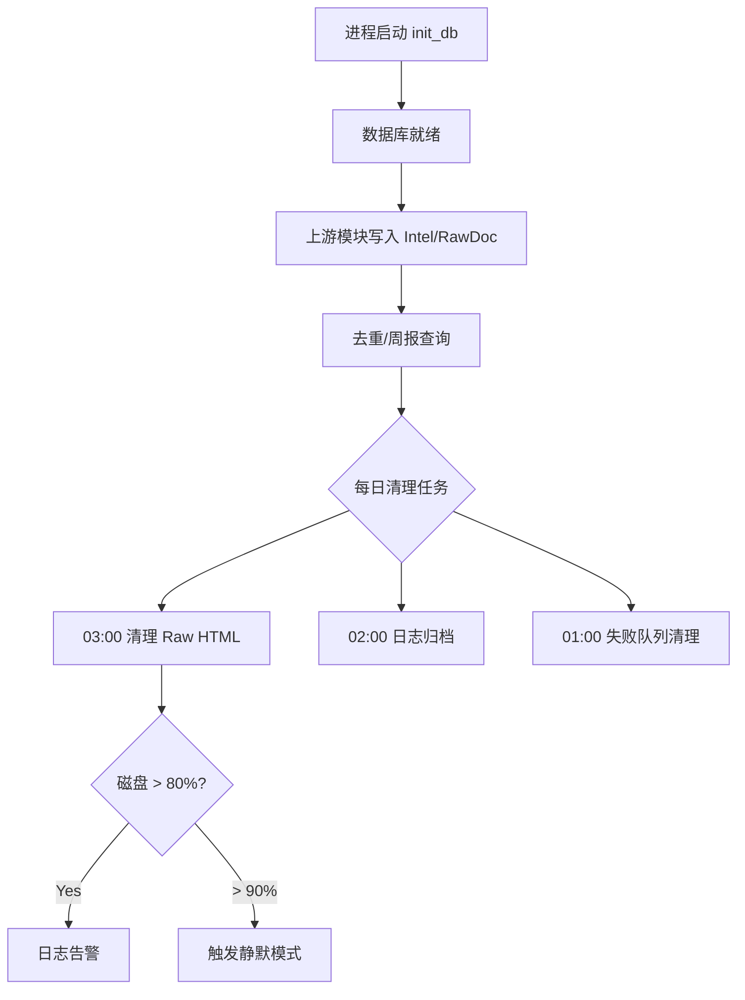

# 存储治理系统 Spec

## 1. Overview 概述

存储治理系统（L1-7）是竞品情报 Agent 的数据底座，负责结构化情报的持久化（SQLite）、原始内容的文件落盘（HTML/JSON/Markdown）、以及过期数据的定时清理。所有上游模块（采集、处理、周报）均依赖本模块进行数据读写。

本模块对应 PRD 场景 E（数据生命周期管理），实现功能 E-01（Raw HTML 清理）、E-04（磁盘空间告警，与 L1-6 协作）。

## 2. Goals & Non-Goals 目标与非目标

### Goals：本期落地范围

- SQLite 数据库初始化与 CRUD 接口（情报表、原始文档表、运行日志表）
- Raw HTML 按竞品/日期/哈希落盘
- 结构化情报 JSON 按类型归档（定价历史、变更日志）
- 周报 Markdown 归档
- Raw HTML 30 天自动清理（每日 03:00）
- 为去重引擎提供查询接口：intel URL 永久查询、raw_doc content_hash 查询（≤ 100ms）

### Non-Goals：明确剔除范围

- 不使用 PostgreSQL（V1 仅用 SQLite）
- 不做数据加密 at-rest
- 不做自动备份到云存储
- 不做向量数据库（V2 语义去重时再引入）
- 情报结构化数据不自动清理（永久保留）

## 3. Detailed Design 详细设计

### 3.1 功能描述

本模块提供三类存储能力：

1. **关系型存储（SQLite）**：Intel 情报、RawDoc 元数据、运行日志、失败队列
2. **文件系统存储**：Raw HTML、JSON 归档、周报 Markdown、失败推送记录
3. **生命周期管理**：定时清理过期数据，磁盘空间监控（告警逻辑与 L1-6 协作）

### 3.2 数据模型

#### 3.2.1 SQLite 表结构

**表 `intel`（结构化情报，永久保留）**

```sql
CREATE TABLE IF NOT EXISTS intel (
    id              TEXT PRIMARY KEY,
    raw_id          TEXT NOT NULL,
    competitor      TEXT NOT NULL,
    intel_type      TEXT NOT NULL,          -- new_feature|version_update|pricing_change|ui_change
    title           TEXT NOT NULL,
    summary         TEXT NOT NULL,
    confidence      REAL NOT NULL,
    source_url      TEXT NOT NULL,
    discovered_at   TIMESTAMP NOT NULL,     -- ISO8601 UTC
    status          TEXT DEFAULT 'pending', -- pending|pushed|rejected
    dedup_status    TEXT DEFAULT 'ok'       -- ok|unchecked
    extracted_by    TEXT DEFAULT 'llm'      -- llm|rule_fallback
);
CREATE INDEX IF NOT EXISTS idx_intel_time ON intel(discovered_at);
CREATE INDEX IF NOT EXISTS idx_intel_competitor ON intel(competitor);
CREATE INDEX IF NOT EXISTS idx_intel_status ON intel(status);
CREATE INDEX IF NOT EXISTS idx_intel_source_url ON intel(source_url);
```

**`intel.source_url` 存储规则：** 写入时经 `normalize_url()` 归一化（见 SPEC-2026-020），去除 utm 等追踪参数，保证 Pre-LLM URL 去重精确匹配。

**表 `raw_doc`（原始文档元数据，含 RSS 元数据）**

```sql
CREATE TABLE IF NOT EXISTS raw_doc (
    id              TEXT PRIMARY KEY,
    competitor      TEXT NOT NULL,
    source_url      TEXT NOT NULL,
    source_type     TEXT NOT NULL,          -- rss|http|search
    content_hash    TEXT NOT NULL,
    file_path       TEXT,                   -- storage/raw/... 相对路径
    fetched_at      TIMESTAMP NOT NULL
);
CREATE UNIQUE INDEX IF NOT EXISTS idx_raw_hash ON raw_doc(content_hash);
CREATE INDEX IF NOT EXISTS idx_raw_competitor ON raw_doc(competitor, fetched_at);
```

**表 `run_log`（运行日志元数据，辅助 structlog 文件日志）**

```sql
CREATE TABLE IF NOT EXISTS run_log (
    id              INTEGER PRIMARY KEY AUTOINCREMENT,
    job_type        TEXT NOT NULL,          -- collection|weekly|cleanup
    started_at      TIMESTAMP NOT NULL,
    finished_at     TIMESTAMP,
    status          TEXT NOT NULL,          -- success|partial_success|failed
    sources_total   INTEGER DEFAULT 0,
    sources_failed  INTEGER DEFAULT 0,
    intel_new       INTEGER DEFAULT 0,
    duration_ms     INTEGER,
    token_input     INTEGER DEFAULT 0,
    token_output    INTEGER DEFAULT 0
);
```

**表 `failed_push`（推送失败队列，7 天清理）**

```sql
CREATE TABLE IF NOT EXISTS failed_push (
    id              INTEGER PRIMARY KEY AUTOINCREMENT,
    intel_id        TEXT NOT NULL,
    webhook_url     TEXT NOT NULL,
    error_message   TEXT,
    retry_count     INTEGER DEFAULT 0,
    created_at      TIMESTAMP NOT NULL,
    resolved_at     TIMESTAMP
);
```

#### 3.2.2 数据保留策略

| 数据类型 | 保留期限 | 清理策略 | 优先级 |
|----------|----------|----------|--------|
| Raw HTML / 原始内容 | 30 天 | 每日 03:00 定时删除 | Must |
| 结构化情报（intel 表） | 永久 | 不自动清理 | Must |
| 周报 Markdown | 52 周 | 超过 52 周删除或 gzip 归档 | Should |
| 运行日志（文件） | 14 天压缩，30 天删除 | 每日 02:00 | Should |
| 失败队列（failed_push） | 7 天 | 每日 01:00 删除未解决记录 | Should |

#### 3.2.3 文件系统目录规范

| 路径模式 | 内容 | 示例 |
|----------|------|------|
| `data/intel.db` | SQLite 数据库 | — |
| `storage/raw/{competitor}/{YYYY-MM-DD}/{hash}.html` | 原始 HTML | `storage/raw/competitor_a/2026-05-30/a1b2c3.html` |
| `docs/pricing-history/{competitor}/{YYYY-MM-DD}.json` | 定价变更 JSON | — |
| `docs/changelogs/{competitor}/{YYYY-MM-DD}.json` | 变更日志 JSON | — |
| `reports/weekly/{YYYY-MM-DD}.md` | 周报 Markdown | `reports/weekly/2026-05-26.md` |
| `data/failed_push.txt` | 推送失败文本兜底 | — |
| `logs/{YYYY-MM-DD}.json` | structlog 日志文件 | — |

**表职责划分：**

| 表 | 用途 | 去重角色 | 保留 |
|----|------|----------|------|
| `intel` | 结构化情报 | Process URL 去重（rss/search）；Post-LLM 标题去重 | 永久 |
| `raw_doc` | 原始内容元数据 | **Collect 阶段** HTTP hash 去重；RSS 元数据 | 30 天随 HTML 清理 |

**content_hash 计算规则：** `SHA256(competitor + source_url + content[:1000])` 取前 12 位十六进制（与 SPEC-2026-020 一致）。

**边界说明：** raw_doc 30 天清理后，HTTP 监控页若内容未变可能再次触发 LLM；由 Post-LLM 标题去重兜底，避免重复入库。

### 3.3 API 接口定义（Python 内部接口）

实现于 `infra/db.py`：

```python
# 初始化
def init_db() -> None: ...

# Intel CRUD
def save_intel(intel: Intel) -> None: ...
def get_intel_by_id(intel_id: str) -> Intel | None: ...
def get_intel_by_time_range(start: str, end: str, status: str | None = None) -> list[Intel]: ...
def update_intel_status(intel_id: str, status: str) -> None: ...

# 去重查询
def intel_url_exists(normalized_url: str) -> bool: ...  # status IN ('pending','pushed')
def content_hash_exists(content_hash: str) -> bool: ...
def touch_raw_doc_by_hash(content_hash: str) -> None: ...
def get_recent_titles(competitor: str, days: int = 7) -> list[str]: ...

# RawDoc
def save_raw_doc(raw: RawDoc, file_path: str | None) -> None: ...

# 运行日志
def save_run_log(...) -> int: ...
def update_run_log(log_id: int, ...) -> None: ...

# 失败队列
def save_failed_push(intel_id: str, webhook: str, error: str) -> None: ...
def get_unresolved_failed_pushes() -> list[dict]: ...

# 清理
def cleanup_raw_html(older_than_days: int = 30) -> int: ...
def cleanup_failed_push(older_than_days: int = 7) -> int: ...
```

### 3.4 L3 任务详细设计

#### L3-7.1.1 SQLite 初始化 [Must]

**行为：**
- 进程首次启动调用 `init_db()`
- 自动创建 `data/` 目录和 `intel.db` 文件
- 执行 DDL 创建全部 4 张表及索引
- 若表已存在则跳过（幂等）
- 初始化失败则阻止进程启动，输出具体 SQL 错误

**边界：**
- `data/intel.db` 已存在但损坏 → 日志报错，进程退出，提示手动删除或修复

#### L3-7.1.2 情报表 CRUD 接口 [Must]

**行为：**
- `save_intel`：INSERT，主键冲突时抛异常（不应重复写入同一 ID）
- `get_intel_by_id`：按 ID 查询，不存在返回 None
- `get_intel_by_time_range`：BETWEEN 查询；**参数 start/end 必须为 UTC ISO8601 字符串**（见 SPEC-2026-001 §3.8）；支持 status 过滤，按 discovered_at DESC 排序
- `update_intel_status`：UPDATE status 字段，记录不存在时静默失败并日志 warning
- `intel_url_exists(normalized_url)`：查 `intel` 表 `source_url` 精确匹配；**仅 status ∈ {pending, pushed}**；rejected 不阻断
- `content_hash_exists(hash)`：查 `raw_doc` UNIQUE 索引；由 **010 collect** 调用
- `touch_raw_doc_by_hash(hash)`：更新 fetched_at，不新增记录
- `get_recent_titles(competitor, days)`：Post-LLM 标题去重，默认 7 天

**性能：** `get_recent_titles(competitor, 7)` 在 1000 条记录下耗时 ≤ 100ms。

#### L3-7.2.1 Raw HTML / 元数据落盘 [Must]

**行为：**
- **HTTP 源：** 仅当 collect 判定为新 hash 时写入 HTML + raw_doc（见 010 L3-1.1.4）
- **RSS 源：** 通过预去重后才写入 raw_doc（file_path=NULL）
- 若 content_hash 已存在（UNIQUE 约束），跳过写入文件，仅更新 fetched_at

**边界：**
- 磁盘满（静默模式）→ 跳过文件写入，仅保存 raw_doc 元数据（file_path=NULL），日志 warning

#### L3-7.2.2 结构化情报 JSON 存储 [Must]

**行为：**
- intel_type = `pricing_change` 时，额外写入 `docs/pricing-history/{competitor}/{date}.json`
- intel_type = `version_update` 时，额外写入 `docs/changelogs/{competitor}/{date}.json`
- JSON 格式：`{"id", "title", "summary", "source_url", "discovered_at"}`
- 同日多条记录追加为 JSON 数组

#### L3-7.2.3 周报 Markdown 归档 [Must]

**行为：**
- 周报生成后写入 `reports/weekly/{week_start}.md`
- 文件内容为完整 Markdown 文本
- 若文件已存在则覆盖（同周重复生成场景）

#### L3-7.3.1 Raw HTML 30 天清理 [Must]

**行为：**
- APScheduler cron：每日 03:00 触发
- 扫描 `storage/raw/` 下所有子目录，删除 fetched_at 超过 30 天的 HTML 文件
- 同步删除 `raw_doc` 表中对应记录（file_path 匹配）
- 返回清理文件数量，写入 run_log

**边界：**
- 清理过程中新文件写入 → 不冲突（按日期目录隔离）
- 磁盘使用率 > 90% → 触发静默模式（见 SPEC-2026-060），暂停新的 Raw HTML 写入

#### L3-7.3.2 日志归档 [Should]

**行为：**
- 每日 02:00 触发
- `logs/` 下 14 天前的 `.json` 文件 gzip 压缩为 `.json.gz`
- 30 天前的日志文件（含 .gz）删除

#### L3-7.3.3 失败队列清理 [Should]

**行为：**
- 每日 01:00 触发
- 删除 `failed_push` 表中 created_at 超过 7 天且 resolved_at IS NULL 的记录
- 清理数量 > 0 时日志 warning

### 3.5 业务流程图



## 4. Technical Constraints 技术约束

| 约束 | 值 |
|------|-----|
| 数据库 | SQLite 3.x，单文件 `data/intel.db` |
| 连接模式 | `check_same_thread=False`，上下文管理器自动 commit/close |
| 文件编码 | UTF-8 |
| hash 算法 | SHA256，取前 12 位 hex |
| 单次清理批量 | 不分批，目录扫描全量删除（预计 < 10000 文件） |
| 磁盘告警阈值 | 80% 告警日志，90% 触发静默模式 |

## 5. Error Handling 异常错误处理

| 异常 | 处理 | 返回/日志 |
|------|------|-----------|
| DB 文件损坏 | 进程启动失败，日志 error + 修复提示 | exit(1) |
| INSERT 主键冲突 | 抛 IntegrityError，上游捕获跳过 | log warning |
| 磁盘满（写入 HTML） | 跳过文件写入，file_path=NULL | log warning, silent_mode |
| 清理任务异常 | 捕获异常，记录 run_log status=failed | 不阻塞其他清理子任务 |
| 查询超时（> 5s） | 日志 error，返回空列表 | 上游降级跳过去重 |

## 6. Acceptance Criteria 验收标准

**AC-1：数据库初始化**

- Given：首次启动，data/ 目录不存在
- When：调用 init_db()
- Then：创建 data/intel.db；4 张表及全部索引存在；进程正常继续

**AC-2：情报写入与查询**

- Given：构造合法 Intel 对象
- When：save_intel() 后 get_intel_by_id()
- Then：返回对象字段与写入一致；discovered_at 为 ISO8601 UTC 格式

**AC-3：时间范围查询（UTC）**

- Given：数据库有 10 条情报，discovered_at 为 UTC；传入 UTC 边界字符串
- When：get_intel_by_time_range(week_start_utc, week_end_utc)
- Then：仅返回范围内记录，无遗漏无跨界

**AC-4：Raw HTML 落盘路径**

- Given：采集到 competitor_a 的 HTML 内容
- When：执行落盘
- Then：文件存在于 `storage/raw/competitor_a/{today}/{hash}.html`；raw_doc 表有对应记录

**AC-5：30 天清理**

- Given：存在 31 天前和 29 天前的测试 HTML 文件
- When：执行 cleanup_raw_html(30)
- Then：31 天前的文件被删除；29 天前的保留；返回 deleted_count ≥ 1

**AC-6：去重查询性能**

- Given：intel 表有 1000 条记录
- When：get_recent_titles("competitor_a", 7)
- Then：耗时 ≤ 100ms；返回正确标题列表

**AC-7：磁盘告警**

- Given：磁盘使用率达到 82%
- When：清理任务中的磁盘检查执行
- Then：日志输出 disk_warning 事件，level=warning

**AC-8：RSS 元数据写入**

- Given：RSS 采集 2 条 entry
- When：save_raw_doc(file_path=None)
- Then：raw_doc 表 2 条记录；file_path 均为 NULL

**AC-9：intel_url_exists 排除 rejected**

- Given：intel 表存在 URL 且 status=rejected
- When：intel_url_exists(same_url)
- Then：返回 False

**AC-10：hash 去重写入**

- Given：相同 competitor + source_url + content 的 RawDoc 已存在
- When：再次采集相同内容
- Then：不重复写入 HTML 文件；raw_doc 表不新增记录

## 7. Context References 参考依赖

| 类型 | 引用 |
|------|------|
| 系统 Spec | SPEC-2026-001 |
| 韧性保障 | SPEC-2026-060（磁盘静默模式触发） |
| 代码文件 | `infra/db.py` |
| 数据模型 | `models.py` — RawDoc, Intel |
| 上游消费者 | SPEC-2026-010（raw 落盘）、SPEC-2026-020（去重查询）、SPEC-2026-040（周报查询） |

## 8. Open Questions 待定问题

| # | 问题 | 建议 |
|---|------|------|
| Q-1 | 周报超过 52 周后删除还是 gzip 归档 | 建议 gzip 归档到 `reports/weekly/archive/` |
| Q-2 | readonly 模式下本地 JSON 暂存格式 | 建议 `data/pending_import/{timestamp}.json` 数组 |

## 9. Changelog 变更履历

| 日期 | 版本 | 修改内容 | 修改人 |
|------|------|----------|--------|
| 2026-05-30 | 1.0 | 初稿创建 | Product Team |
| 2026-05-30 | 1.1 | P0 修订：intel URL 永久去重；RSS 写 raw_doc 元数据；UTC 查询约定 | Product Team |
| 2026-05-30 | 1.2 | P0/P1：intel_url 排除 rejected；touch_raw_doc；collect 阶段写 raw_doc | Product Team |
