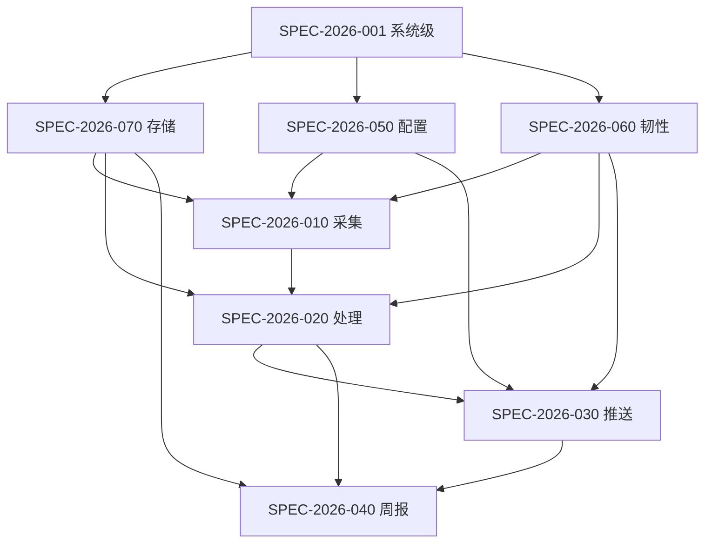

# 竞品情报 Agent — Spec 文档

> 最后更新：2026-05-30（P0/P1 修订 v1.2）  
> **Spec 状态追踪见 [INDEX.md](INDEX.md)**（文档状态、实现进度、里程碑）

## 概述

本目录包含竞品情报 Agent 系统的全部 Spec 文档，采用 **L1 系统级 + L2 模块级** 两层结构，L3 任务级需求内嵌于 L2 Spec 的子章节中。所有 Spec 遵循统一模板：YAML FrontMatter + 9 章节 Markdown 正文。

## Spec 编号规则

| 层级 | 编号范围 | 示例 |
|------|----------|------|
| L1 系统级 | SPEC-2026-001 | SPEC-2026-001-system.md |
| L2 模块级 | SPEC-2026-010 ~ 070 | SPEC-2026-010-collection.md |

- 格式：`SPEC-{年份}-{三位编号}`
- FrontMatter `dependencies` 字段声明上下游依赖关系
- 状态流转：`draft` → `in-review` → `approved` → `implemented` → `deprecated`

## Spec 清单

> 完整状态（版本、实现进度、里程碑）见 **[INDEX.md](INDEX.md)**。

| Spec ID | 文件 | 模块 | 状态 | 优先级 |
|---------|------|------|------|--------|
| SPEC-2026-001 | [L1/SPEC-2026-001-system.md](L1/SPEC-2026-001-system.md) | 系统级（全局架构、SLO、数据模型） | draft | P0 |
| SPEC-2026-010 | [L2/SPEC-2026-010-collection.md](L2/SPEC-2026-010-collection.md) | L1-1 情报采集引擎 | draft | P0 |
| SPEC-2026-020 | [L2/SPEC-2026-020-processing.md](L2/SPEC-2026-020-processing.md) | L1-2 情报处理中心 | draft | P0 |
| SPEC-2026-030 | [L2/SPEC-2026-030-push.md](L2/SPEC-2026-030-push.md) | L1-3 推送网关 | draft | P0 |
| SPEC-2026-040 | [L2/SPEC-2026-040-weekly.md](L2/SPEC-2026-040-weekly.md) | L1-4 周报工厂 | draft | P0 |
| SPEC-2026-050 | [L2/SPEC-2026-050-config-ops.md](L2/SPEC-2026-050-config-ops.md) | L1-5 配置与运维中心 | draft | P0 |
| SPEC-2026-060 | [L2/SPEC-2026-060-resilience.md](L2/SPEC-2026-060-resilience.md) | L1-6 韧性保障系统 | draft | P0 |
| SPEC-2026-070 | [L2/SPEC-2026-070-storage.md](L2/SPEC-2026-070-storage.md) | L1-7 存储治理系统 | draft | P0 |
## 依赖矩阵

### 数据流依赖

| 数据流 | 上游 Spec | 下游 Spec | 数据对象 |
|--------|-----------|-----------|----------|
| 配置流 | 050 配置 | 010 采集, 030 推送 | competitors.yaml |
| 原始内容流 | 010 采集（含预去重） | 020 处理 | RawDoc（新 hash / 新 URL） |
| 结构化情报流 | 020 处理 | 010 job_collect 编排 → 030 推送 | Intel（should_push 为真） |
| 沉淀流 | 020 处理 | 040 周报 | Intel (status=pending) |
| 汇总流 | 020 处理 + 070 存储 | 040 周报 | Intel (时间范围查询) |
| 推送流 | 040 周报 | 030 推送 | Markdown |
| 历史查询流 | 070 存储 | 010 采集, 020 处理 | content_hash / intel URL / 近 7 天标题 |
| 容错流 | 060 韧性 | 010, 020, 030 | 重试/降级策略 |

## L3 任务覆盖清单

### Must Have（38 项）

| L3 ID | 所属 Spec | 任务名称 |
|-------|-----------|----------|
| L3-1.1.1 | 010 | RSS 源配置解析 |
| L3-1.1.2 | 010 | RSS Feed 拉取与解析 |
| L3-1.1.3 | 010 | RSS 内容标准化 |
| L3-1.1.4 | 010 | 采集阶段预去重（HTTP hash / RSS URL） |
| L3-1.2.1 | 010 | HTTP 客户端封装 |
| L3-1.2.2 | 010 | 静态页内容标准化 |
| L3-1.4.1 | 010 | APScheduler 定时器配置 |
| L3-1.4.2 | 010 | 多源并发控制 |
| L3-2.1.1 | 020 | RawDocument Schema 定义 |
| L3-2.1.2 | 020 | HTML 文本清洗 |
| L3-2.2.1 | 020 | Prompt 模板管理 |
| L3-2.2.2 | 020 | OpenAI API 客户端封装 |
| L3-2.2.3 | 020 | 结构化情报提取 |
| L3-2.2.4 | 020 | 提取结果 Schema 校验 |
| L3-2.3.1 | 020 | 规则评分引擎 |
| L3-2.4.0 | 020 | Pre-LLM 预去重（process 阶段 rss/search URL） |
| L3-2.4.1 | 020 | URL 归一化规则 |
| L3-2.4.2 | 020 | 标题相似度去重 |
| L3-2.4.3 | 020 | 历史情报库查询接口 |
| L3-3.1.1 | 030 | 飞书 Webhook 消息构建 |
| L3-3.2.1 | 030 | 高置信度实时推送 |
| L3-3.2.2 | 030 | 推送失败重试与本地降级 |
| L3-3.2.3 | 030 | 低置信度沉淀队列 |
| L3-4.1.1 | 040 | 时间范围筛选 |
| L3-4.1.2 | 040 | 按竞品分组 |
| L3-4.2.1 | 040 | 情报摘要复用/生成 |
| L3-4.2.3 | 040 | Markdown 格式化 |
| L3-4.3.1 | 040 | 周一 9:00 定时触发 |
| L3-4.3.2 | 040 | Markdown 周报推送 |
| L3-5.1.1 | 050 | YAML 配置 Schema 定义 |
| L3-5.1.2 | 050 | 配置加载与生效 |
| L3-5.1.3 | 050 | LLM 后端配置 |
| L3-5.3.1 | 050 | 结构化日志 |
| L3-6.1.1 | 060 | 网络超时重试 |
| L3-6.1.2 | 060 | HTTP 状态码分层 |
| L3-6.2.0 | 060 | LLM Provider 抽象层 |
| L3-6.2.1 | 060 | LLM API 重试（Provider 层） |
| L3-6.2.2 | 060 | 规则提取降级 |
| L3-7.1.1 | 070 | SQLite 初始化 |
| L3-7.1.2 | 070 | 情报表 CRUD 接口 |
| L3-7.2.1 | 070 | Raw HTML 落盘 |
| L3-7.2.2 | 070 | 结构化情报 JSON 存储 |
| L3-7.2.3 | 070 | 周报 Markdown 归档 |
| L3-7.3.1 | 070 | Raw HTML 30 天清理 |

### Should Have（11 项）

| L3 ID | 所属 Spec | 任务名称 |
|-------|-----------|----------|
| L3-1.3.1 | 010 | 搜索 API 配置与执行 |
| L3-3.1.2 | 030 | 钉钉 Webhook 消息构建 |
| L3-4.1.3 | 040 | 情报类型排序 |
| L3-4.2.2 | 040 | 周报总结生成（LLM） |
| L3-5.2.1 | 050 | Webhook 配置管理 |
| L3-5.3.2 | 050 | 日志轮转与归档 |
| L3-5.4.1 | 050 | 命令行审核工具 |
| L3-6.2.3 | 060 | JSON 格式失败处理 |
| L3-6.3.1 | 060 | 任务超时保护 |
| L3-6.3.2 | 060 | 磁盘空间监控 |
| L3-6.3.3 | 060 | LLM 限流模式 |

## 推荐实现顺序

按依赖关系，建议以下顺序实现代码：

| 顺序 | Spec | 代码文件 | 说明 |
|------|------|----------|------|
| 1 | 070 存储 | `infra/db.py`, `models.py` | 数据底座 |
| 2 | 050 配置 | `config/settings.py`, `config/competitors.yaml`, `infra/log.py` | 配置加载 |
| 3 | 060 韧性 | `infra/llm/`（Provider + 重试 + 降级） | 横切能力 |
| 4 | 010 采集 | `intel/collect.py` | 流水线起点 |
| 5 | 020 处理 | `intel/process.py`, `prompts/v1/extract.j2` | 核心处理 |
| 6 | 030 推送 | `intel/push.py` | 输出通道 |
| 7 | 040 周报 | `intel/weekly.py`, `prompts/v1/weekly_summary.j2` | 周报生成 |
| 8 | — | `scheduler.py`, `main.py`, `run_once.py` | 调度入口（任务表见 L1 §3.9） |

## Intel 状态机

完整定义见 [SPEC-2026-001 §3.10](L1/SPEC-2026-001-system.md)。

| 状态 | 含义 | 转换 |
|------|------|------|
| pending | 已入库，未成功推送 | push 成功 → pushed；CLI 驳回 → rejected |
| pushed | 已成功推送 | 终态 |
| rejected | 人工驳回 | 同 URL 再次采集可重新进入流水线 |

**推送编排边界：** `process()` 仅产出 Intel；`job_collect` 在每条 process 成功后调用 `push()`（见 010 L3-1.4.2）。

## 调度任务注册表

完整定义见 [SPEC-2026-001 §3.9](L1/SPEC-2026-001-system.md)。

| Job ID | 触发 | 函数 | Spec |
|--------|------|------|------|
| collect | interval（默认 60min） | job_collect | 010 |
| weekly | 周一 09:00 | job_weekly | 040 |
| cleanup_failed_push | 每日 01:00 | job_cleanup_failed_push | 070 |
| cleanup_logs | 每日 02:00 | job_cleanup_logs | 050 |
| cleanup_raw_html | 每日 03:00 | job_cleanup_raw_html | 070 |
| disk_check | 每 60min | job_disk_check | 060 |

## PRD 功能 ID 映射

| PRD 功能 ID | 功能名称 | 负责 Spec |
|-------------|----------|-----------|
| A-01 | 定时触发采集 | 010 |
| A-02 | 信息源读取 | 010 |
| A-03 | 内容标准化 | 010, 020 |
| A-04 | 情报提取（LLM） | 020 |
| A-05 | 智能去重 | 020 |
| A-06 | 置信度评分 | 020 |
| A-07 | 实时推送 | 030 |
| A-08 | 低置信度沉淀 | 030 |
| B-01 | 周报定时触发 | 040 |
| B-02 | 时间范围筛选 | 040 |
| B-03 | 按竞品分组 | 040 |
| B-04 | 按类型排序 | 040 |
| B-05 | 摘要生成（LLM） | 040 |
| B-06 | 周报总结生成（LLM） | 040 |
| B-07 | 周报格式化 | 040 |
| B-08 | 周报推送 | 040, 030 |
| C-01 | 信息源配置 | 050 |
| C-02 | 推送渠道配置 | 050 |
| C-03 | 运行日志 | 050 |
| C-04 | 人工审核入口 | 050 |
| D-01 ~ D-08 | 失败处理与降级 | 060, 030 |
| E-01 ~ E-04 | 数据生命周期 | 070, 060 |

## 代码文件映射

| 代码路径 | 负责 Spec |
|----------|-----------|
| `models.py` | 001 |
| `config/competitors.yaml` | 001, 050 |
| `config/settings.py` | 050 |
| `intel/collect.py` | 010 |
| `intel/process.py` | 020 |
| `intel/push.py` | 030 |
| `intel/weekly.py` | 040 |
| `infra/db.py` | 070 |
| `infra/llm/` | 020, 040, 050, 060 |
| `infra/log.py` | 050 |
| `prompts/v1/extract.j2` | 020 |
| `prompts/v1/weekly_summary.j2` | 040 |
| `scheduler.py` | 010, 040 |
| `main.py` | 001 |
| `run_once.py` | 010 |
| `scripts/review_pending.py` | 050 |

## 验收标准统计

| Spec | AC 数量 | Must L3 | Should L3 |
|------|---------|---------|-----------|
| 001 系统 | 8 | — | — |
| 010 采集 | 16 | 7 | 1 |
| 020 处理 | 15 | 9 | 0 |
| 030 推送 | 10 | 4 | 1 |
| 040 周报 | 11 | 6 | 2 |
| 050 配置 | 8 | 3 | 3 |
| 060 韧性 | 9 | 4 | 4 |
| 070 存储 | 10 | 5 | 1 |
| **合计** | **87** | **38** | **12** |
